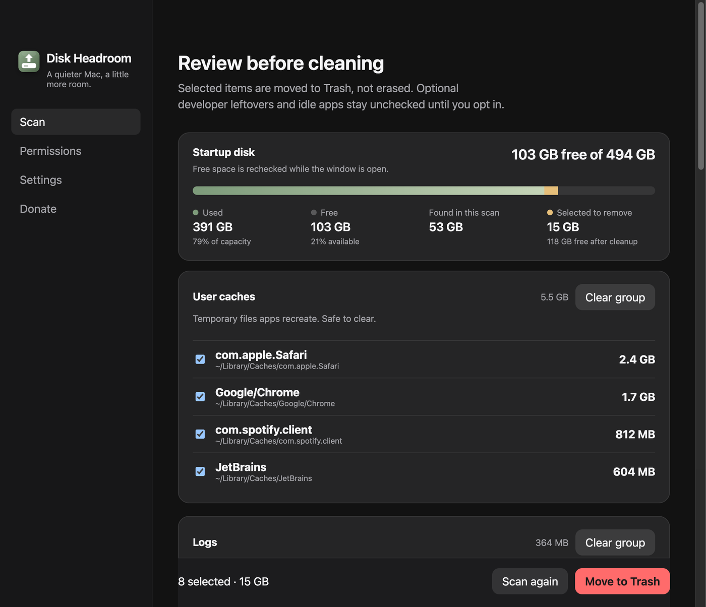
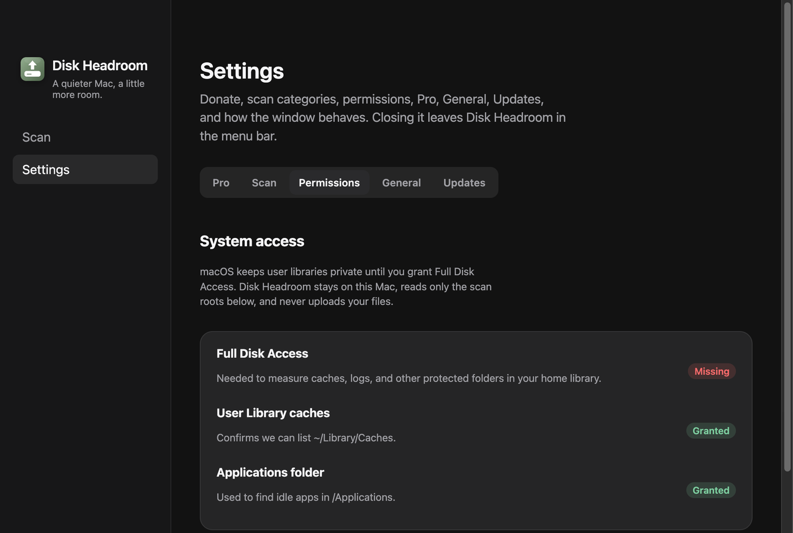
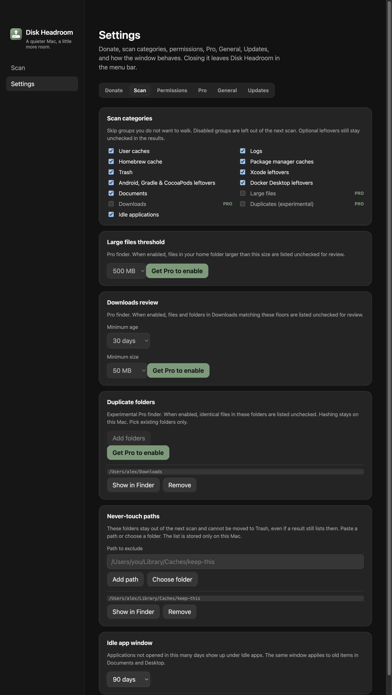
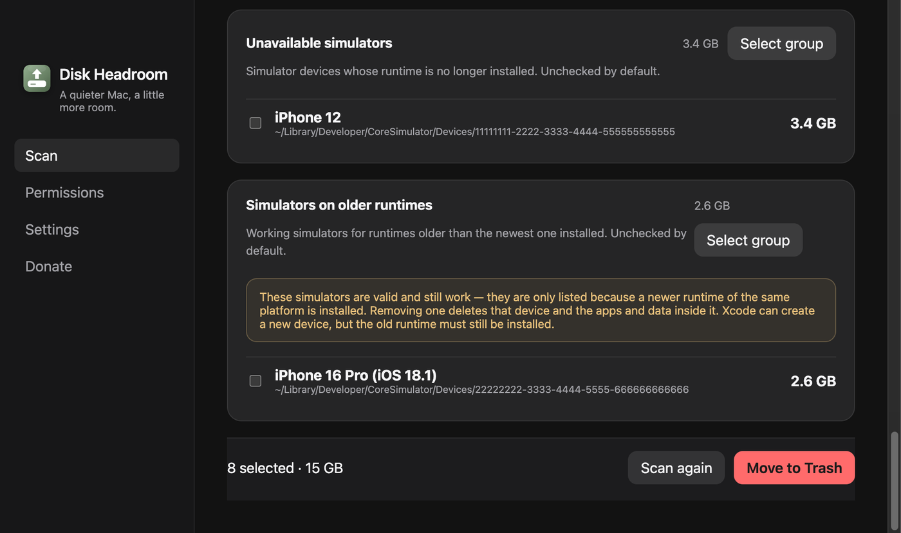
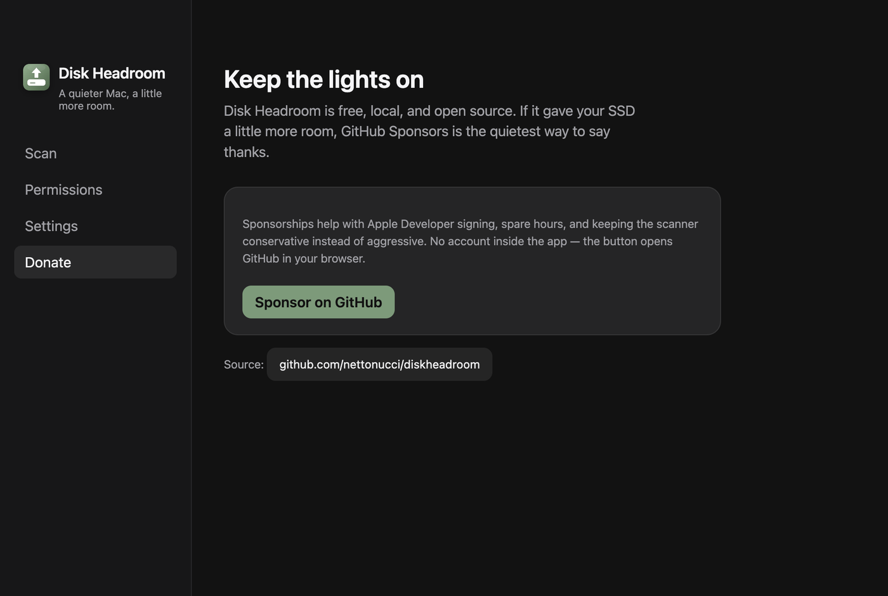

<p align="center">
  <picture>
    <source media="(prefers-color-scheme: dark)" srcset="assets/brand/logo-lockup-dark.svg">
    
  </picture>
</p>

# Disk Headroom

macOS storage is finite. Caches swell, logs linger, and applications sit unopened for months. **Disk Headroom** is a small, local Electron app for Mac that shows you what can go — then moves it to Trash when you say so.

It is not a “one-click miracle cleaner.” You review every group, optional developer leftovers stay off by default, and idle apps are never selected for you.


[](https://github.com/sponsors/nettonucci)

## What it does

- Measures free space on the startup disk and keeps that reading current while open
- Scans conservative junk locations in your home library
- Lists applications that have not been opened in 30, 90, 180, or 365 days (90 by default)
- Shows sizes and paths before anything is touched
- Moves selected items to **Trash** (recoverable) rather than deleting in place
- Lives in the **menu bar** so you can open it, scan, or quit without hunting the Dock
- Speaks English, Brazilian Portuguese, and Spanish

All work stays on your Mac. There is no account, no telemetry, and no cloud.

## Who it is for

People who want a little more room on a Mac they already own — developers with Xcode leftovers, Homebrew users with a fat cache, or anyone whose SSD has been quietly filling up.

If you need forensic deletion, secure erase, or Windows/Linux, this is not that tool.

## Screenshots

| Scan | Review before cleaning |
| --- | --- |
|  |  |

| System access | Settings |
| --- | --- |
|  |  |

<p align="center">
  
</p>

<p align="center">
  
</p>

The captures come from `npm run screenshots`, which renders the real UI against sample data — so no local paths or installed apps leak into this repository.

## Features

| Area | Details |
| --- | --- |
| Startup disk | Used, free, and total on both screens, rechecked while the window is open so emptying the Trash shows up without a relaunch |
| User caches | Top-level folders under `~/Library/Caches` |
| Logs | `~/Library/Logs` |
| Homebrew | `~/Library/Caches/Homebrew` when present |
| Trash | Current Trash contents (so you can empty with eyes open) |
| Xcode (opt-in) | DerivedData, iOS DeviceSupport, Archives, CoreSimulator caches, unavailable simulators, and simulators on older runtimes — **unchecked** until you choose them |
| Docker Desktop (opt-in) | Disk image and Buildx cache — **unchecked**, warning that images, containers, and volumes can be lost |
| Idle apps | `/Applications` and `~/Applications`, skipping Apple system bundles |
| Menu bar | Open, Scan now, Donate, Quit |
| Languages | English, Português (Brasil), Español |
| Donate | In-app page plus this README, both pointing at GitHub Sponsors |

The app follows the macOS language on first launch (with English as the fallback).
You can change it at any time under **Settings → Language**; the window and menu
bar update immediately, and the choice persists across launches.

## Install from DMG

1. Download the latest `Disk Headroom-*-mac.dmg` from [Releases](https://github.com/nettonucci/diskheadroom/releases).
2. Open the disk image and drag **Disk Headroom** into Applications.
3. Launch it from Applications (or Spotlight).
4. Grant **Full Disk Access** when asked (see below). Unsigned or ad-hoc builds may require **System Settings → Privacy & Security → Open Anyway**.

Until the project is notarized with an Apple Developer ID, Gatekeeper may warn on first open. That is expected for a community build.

## macOS permissions

Disk Headroom cannot invent Full Disk Access. Apple requires you to turn it on:

1. Open Disk Headroom → **Permissions**.
2. Choose **Open System Settings**.
3. **Privacy & Security → Full Disk Access**.
4. Press **+**, then pick **Disk Headroom** in Applications.
5. Return to the app and press **Recheck**.

### The app is not in the Full Disk Access list

macOS does not add apps to that list for you — you always add them with **+**. In the file picker you can press <kbd>Shift</kbd><kbd>Command</kbd><kbd>G</kbd> and type `/Applications`.

After toggling access, macOS may ask to quit and reopen the app before the change takes effect.

### I granted access and it still says Missing (development only)

macOS assigns each process a *responsible app*, and Full Disk Access is evaluated against that app rather than the binary you see running. When `npm run dev` is started from a terminal or IDE, the responsible app is that terminal — so authorizing `Electron.app` changes nothing while your terminal is unchecked.

The Permissions screen shows this guidance only in development builds, naming the bundle to authorize and the app that launched it.

Pick whichever fits:

```bash
npm run dev:app     # build, then launch detached so Electron.app is responsible
npm run build:mac   # package a DMG and test the real app bundle
```

The remaining option is to grant Full Disk Access to the terminal or IDE itself, which also lets every project it launches read protected files — reasonable on a personal machine, worth thinking about otherwise.

Without Full Disk Access, scans still run on whatever folders the OS allows. Totals will be incomplete; the app says so.

Why this exists: user caches, Mail-adjacent libraries, and similar paths are protected. The scanner only walks known junk roots. It never traverses `/System`.

## How to use

1. Finish the permissions screen (or continue with a limited scan).
2. On **Scan**, review startup-disk usage and press **Scan this Mac**.
3. On results, tick the items you actually want gone. Idle apps, Xcode folders, and Docker Desktop data stay off until you opt in.
4. Press **Move to Trash** and confirm. Restore from Trash if you change your mind — and remember the disk only gains space once the Trash is emptied.
5. Close the window whenever you like — the app remains in the menu bar until **Quit Disk Headroom**.

Idle-app window (30 / 90 / 180 / 365 days) lives under **Settings**. Last-used dates come from Spotlight metadata (`kMDItemLastUsedDate`). Apps Apple ships are skipped.

## Menu bar

Look for the small disk mark on the right side of the menu bar (the extra menubar, not the Dock).

- **Open Disk Headroom** — show the window
- **Scan now** — jump to a scan
- **Donate** — in-app sponsor page
- **Quit Disk Headroom** — leave the menu bar as well

## Build from source

Requires macOS and a recent Node.js (20+ recommended).

```bash
git clone https://github.com/nettonucci/diskheadroom.git
cd diskheadroom
npm install
npm run icons          # PNG, ICNS, and menu-bar templates
npm run dev            # electron-vite, unpacked
```

Production DMG for Apple Silicon:

```bash
npm run build:mac -- --arm64
```

Artifacts land in `dist/`. The builder is configured for **macOS only**. Published
versions are also available from the repository's GitHub Releases page.

Useful scripts:

| Command | Purpose |
| --- | --- |
| `npm run dev` | Development with live reload |
| `npm run dev:app` | Build and launch detached from the terminal, so macOS evaluates permissions against `Electron.app` |
| `npm run typecheck` | Main + renderer TypeScript |
| `npm test` | Run the unit-test suite once |
| `npm run test:watch` | Run unit tests interactively while developing |
| `npm run test:coverage` | Run tests and enforce 90% global coverage |
| `npm run build` | Compile main, preload, and renderer |
| `npm run build:mac` | Compile and package a DMG |
| `npm run icons` | Rasterize `assets/brand` into `build/icon.icns` and the menu bar templates |
| `npm run screenshots` | Rebuild and capture `docs/screenshots` from the UI using sample data |
| `npm run commitlint` | Check the latest commit message against Conventional Commits |
| `npm run release:dry` | Preview the next SemVer bump without tagging |

## Safety and privacy

- Preview first. No silent background deletion.
- Default selections avoid applications and Xcode leftovers.
- Removals go to Trash via Electron’s `shell.trashItem`.
- Paths under `/System` and a short list of OS roots are rejected.
- Settings live in the app’s user-data folder as local JSON.
- Donate opens [GitHub Sponsors](https://github.com/sponsors/nettonucci) in your browser. Nothing else is sent.

Treat this like any disk utility: do not select folders you do not recognize. Clearing caches is usually harmless; removing an application you still need is not.

## Tests and continuous integration

The unit suite uses [Vitest](https://vitest.dev/) and Testing Library. It covers
the scanner, cleaning safeguards, permissions, settings, menu bar controller,
translations, formatting, and renderer workflows with Electron and macOS APIs
mocked at their boundaries.

Coverage is enforced globally at **90%** for statements, branches, functions,
and lines. `npm run test:coverage` exits with an error if any metric falls below
that threshold.

There are exactly two GitHub Actions workflows:

- **CI** runs commitlint, TypeScript, unit tests, and the coverage gate on every
  pull request targeting `main`. Configure `CI / Validate` as a required status
  check in the `main` branch protection rule.
- **Release** repeats typecheck and coverage after a merge to `main`, lets
  semantic-release calculate the next version, builds the signed-ad-hoc arm64
  DMG, verifies its code signature, and attaches it to the GitHub Release.

## Donate

Disk Headroom is free. If it bought your SSD a little more time:

**[github.com/sponsors/nettonucci](https://github.com/sponsors/nettonucci)**

The same link is on the in-app **Donate** screen. Sponsorships help with signing, spare hours, and keeping the scanner conservative.

## Project layout

```
src/main/          Window, menu bar, IPC, scan, trash
src/preload/       contextBridge API
src/renderer/      React UI
src/shared/        Types, constants, translations
assets/brand/      Source SVGs for every icon and logo
build/             Entitlements and generated app icon
resources/         Generated menu bar template images
```

## Brand assets

`assets/brand` is the source of truth; everything under `build/` and `resources/` is generated from it by `npm run icons`, so edit the SVG rather than the PNG.

| File | Used for |
| --- | --- |
| `app-icon-macos.svg` | `build/icon.png` and `build/icon.icns` (Dock, Finder, DMG) |
| `menubar-icon-template.svg` | `resources/trayTemplate.png` and `@2x`, tinted by macOS for light and dark menu bars |
| `logo-lockup-light.svg`, `logo-lockup-dark.svg` | This README and docs |
| `mark-color.svg`, `mark-monochrome.svg`, `wordmark-only.svg` | Standalone mark and wordmark |
| `favicon.svg` | Web or docs favicon |
| `social-preview.svg` | Upload under repository Settings → Social preview |

Rasterization uses [sharp](https://sharp.pixelplumbing.com/), and `.icns` is assembled with Apple's `iconutil`, so `npm run icons` requires macOS.

## Versioning

Versions follow [SemVer](https://semver.org/) (`MAJOR.MINOR.PATCH`) and start at **1.0.0**.
[semantic-release](https://semantic-release.gitbook.io/) runs on every push to `main`, reads Conventional Commits since the last git tag, and publishes release notes plus an Apple Silicon DMG attached to the GitHub Release. It does not push version commits back to the protected branch.

| Commit type | Bump |
| --- | --- |
| `fix:`, `perf:`, `refactor:` | patch (`1.0.0` → `1.0.1`) |
| `feat:` | minor (`1.0.0` → `1.1.0`) |
| `BREAKING CHANGE:` in the footer, or `feat!:` / `fix!:` | major (`1.0.0` → `2.0.0`) |
| `chore:`, `docs:`, `ci:`, `test:` | no release |

Pull requests to `main` are checked with [commitlint](https://commitlint.js.org/). Examples:

```
feat: add idle-app threshold presets
fix: detect Full Disk Access after granting Electron
feat!: require macOS 14
```

Preview locally (does not tag or push):

```bash
npm run release:dry
```

The first Conventional Commit that warrants a release on `main` becomes **v1.0.0**.

## Releasing (optional)

Notarization is not part of the default build. When you are ready for a signed public DMG:

1. Join the Apple Developer Program.
2. Sign with a Developer ID Application certificate.
3. Notarize and staple the app or disk image.
4. Attach the DMG to a GitHub Release.

Until then, document Gatekeeper’s Open Anyway path for testers.

## License

[MIT](LICENSE) © 2026 Netto Nucci
