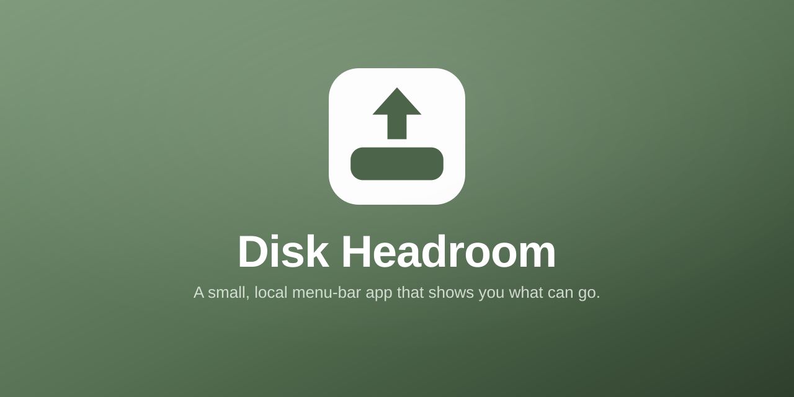
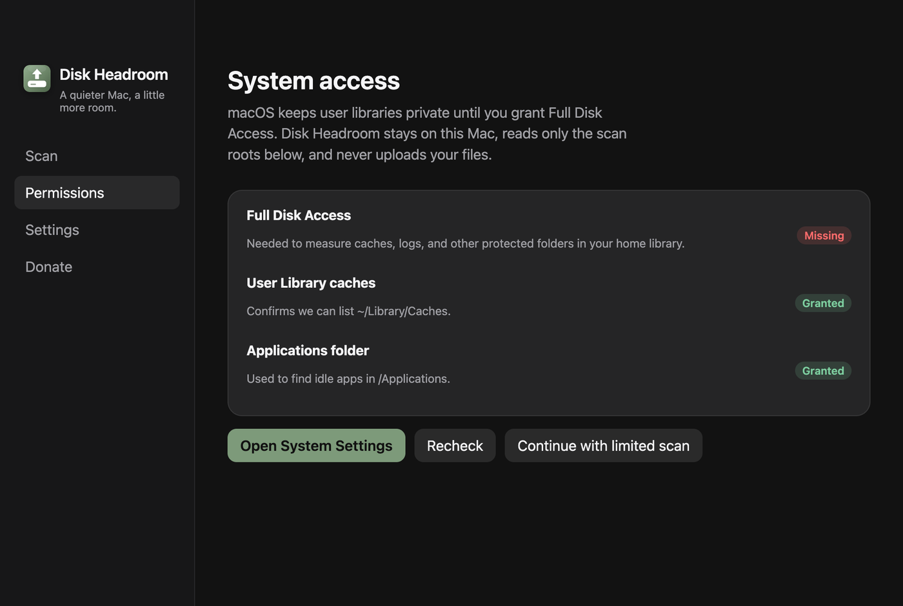
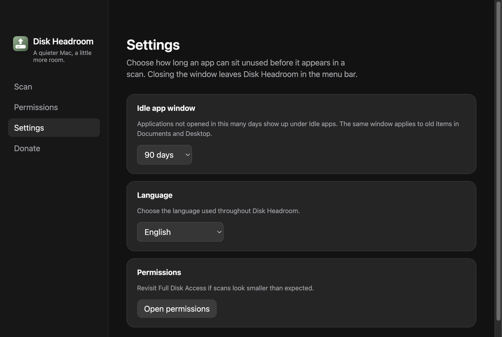
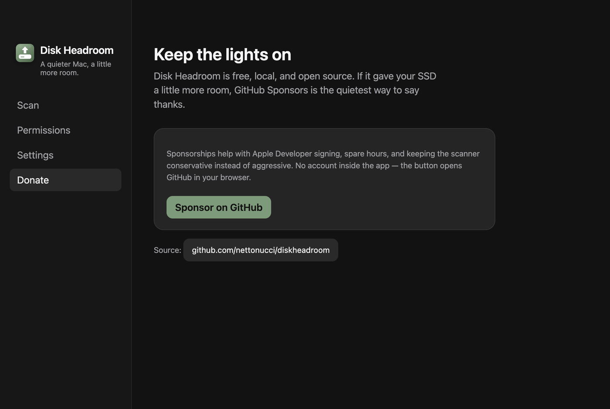

# Disk Headroom no Mac

- **Data:** 2026-08-30
- **Commit / PR:** `56f0f69` / [#1](https://github.com/nettonucci/diskheadroom/issues/1)
- **Tipo:** feat (lançamento)
- **Público:** quem vive com SSD cheio no macOS; quem não quer “limpador milagroso”
- **Formato sugerido no Instagram:** carrossel (6 slides)

## O que mudou

- App local de Electron, só macOS, sem conta e sem telemetria.
- Mede espaço livre no disco de inicialização.
- Escaneia caches, logs, Homebrew e Lixeira no home.
- Lista apps ociosos (30 / 90 / 180 / 365 dias; padrão 90).
- Move o que você marca para a **Lixeira** — não apaga no lugar.
- Menu bar + inglês, português do Brasil e espanhol.
- Tela de permissões (Full Disk Access) e tela de doação (GitHub Sponsors).

## Por que importa

Espaço de volta com revisão humana: você vê tamanho e caminho antes de qualquer coisa ir para a Lixeira.

## Legenda pronta (PT-BR)

O SSD do Mac enche quieto.

Caches, logs, apps que você não abre há meses.

Disk Headroom é um app local para macOS: escaneia o que pode ir embora e só move para a Lixeira quando você confirma.

Sem conta. Sem nuvem. Sem “um clique e sumiu tudo”.

Você revisa cada grupo. Apps ociosos ficam desmarcados até você optar.

Baixa o DMG em github.com/nettonucci/diskheadroom

#DiskHeadroom #macOS #Mac #SSD #EspacoEmDisco #OpenSource #Electron #AppleSilicon #MenuBar #Privacidade

## Hashtags

`#DiskHeadroom` `#macOS` `#Mac` `#SSD` `#EspacoEmDisco` `#OpenSource` `#Electron` `#AppleSilicon` `#MenuBar` `#Privacidade`

## Imagens

Ordem do carrossel:

1. Marca / preview social
2. Scan
3. Resultados
4. Permissões
5. Ajustes
6. Doar

