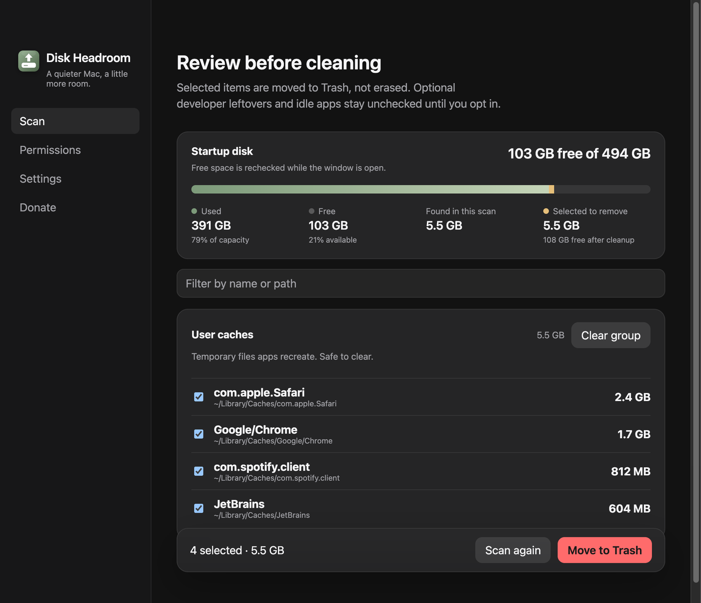

# Android, Gradle e CocoaPods

- **Data:** 2026-08-31
- **Commit / PR:** `efbcc84` / [#29](https://github.com/nettonucci/diskheadroom/issues/29)
- **Tipo:** feat
- **Público:** mobile (Android + iOS com CocoaPods) e quem builda com Gradle
- **Formato sugerido no Instagram:** carrossel ou único

## O que mudou

- Grupo opt-in: caches do Gradle, distribuições do Gradle Wrapper, cache do CocoaPods.
- Caches conservadores do Android SDK: cache, temp, download cache.
- **SDK instalado e AVDs não entram na lista.**
- Desmarcado por padrão — Gradle e CocoaPods baixam de novo o que precisarem.

## Por que importa

Gradle e CocoaPods enchem disco em máquina de mobile. O scan mostra só resto conhecido, sem oferecer o SDK nem os emuladores como alvo.

## Legenda pronta (PT-BR)

Gradle. CocoaPods. Cache do Android.

Se você mexe com mobile, esses três já comeram um pedaço do SSD.

O Disk Headroom agora lista leftovers conhecidos.

SDK e AVDs ficam de fora. Só cache, temp e wrapper.

Desmarcado. Você escolhe. Lixeira. As ferramentas baixam de novo no próximo build.

#DiskHeadroom #AndroidDev #Gradle #CocoaPods #iOSDev #macOS #MobileDev #SSD

## Hashtags

`#DiskHeadroom` `#AndroidDev` `#Gradle` `#CocoaPods` `#iOSDev` `#macOS` `#MobileDev` `#SSD`

## Imagens

1. Grupos opt-in de Android / Gradle / CocoaPods
2. Resultados (contexto)

