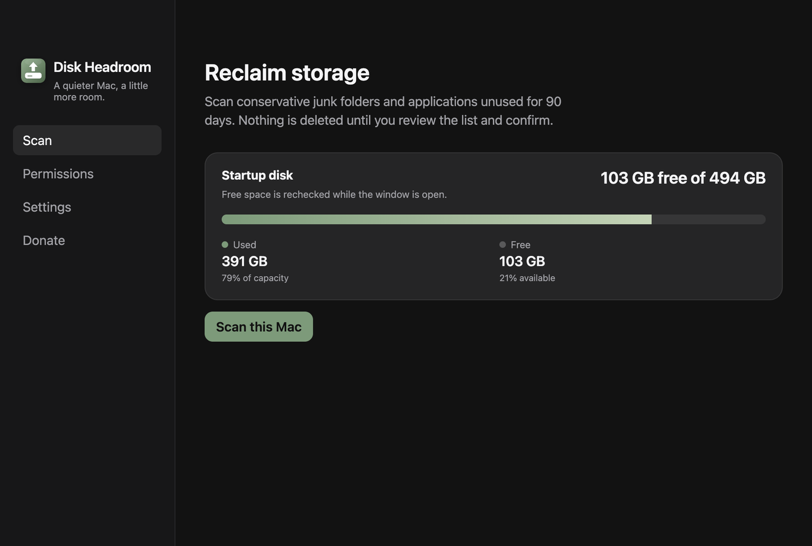

# Docker Desktop + painel de disco

- **Data:** 2026-08-31
- **Commit / PR:** `bd66e2c` / [#26](https://github.com/nettonucci/diskheadroom/issues/26)
- **Tipo:** feat
- **Público:** quem usa Docker Desktop no Mac e vê o disco sumir
- **Formato sugerido no Instagram:** carrossel (scan + aviso)

## O que mudou

- Grupo opt-in: imagem de disco do Docker Desktop e cache do Buildx.
- **Alto impacto:** imagens, containers e volumes podem ir embora se você marcar.
- O app **não** para o Docker e **não** roda `docker prune` — só os caminhos listados vão para a Lixeira.
- Painel do disco de inicialização fica visível no scan e nos resultados (usado / livre / encontrado / selecionado).
- Espaço livre é relido com a janela aberta — esvaziar a Lixeira atualiza o número sem reabrir o app.

## Por que importa

A imagem do Docker costuma ser o “sumidouro” do SSD. Agora você vê o tamanho, o aviso, e só age se quiser.

## Legenda pronta (PT-BR)

Docker Desktop no Mac é famoso por engolir disco.

O Disk Headroom agora mostra a imagem de disco e o cache do Buildx.

Desmarcado. Com aviso claro: imagens, containers e volumes podem ser perdidos.

Nada de prune escondido. Só o que você marca vai para a Lixeira — e ainda dá para restaurar.

Enquanto isso, o painel de disco continua na tela: usado, livre, o que o scan achou, o que você selecionou.

#DiskHeadroom #Docker #DockerDesktop #macOS #DevOps #SSD #Containers #OpenSource

## Hashtags

`#DiskHeadroom` `#Docker` `#DockerDesktop` `#macOS` `#DevOps` `#SSD` `#Containers` `#OpenSource`

## Imagens

1. Scan com painel de disco (slide principal)
2. Resultados (contexto do fluxo de limpeza)

