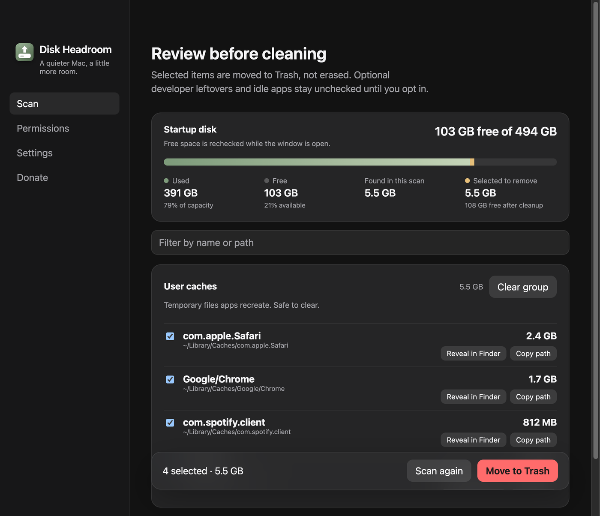

# Mostrar no Finder e copiar caminho

- **Data:** 2026-08-31
- **Commit / PR:** (preencher no merge)
- **Tipo:** feat
- **Público:** quem quer conferir o caminho real antes de mandar para a Lixeira
- **Formato sugerido no Instagram:** único (screenshot de resultados com os botões na linha)

## O que mudou

- Cada item dos resultados ganhou **Mostrar no Finder** e **Copiar caminho**.
- O Finder abre com aquele arquivo ou pasta selecionado.
- Copiar coloca o caminho absoluto na área de transferência, com feedback curto (“Caminho copiado”).
- O app só revela caminhos que saíram do scan atual — o renderer não consegue pedir um caminho qualquer.

## Por que importa

Antes de ir para a Lixeira, dá para abrir o item no Finder ou colar o path e confirmar que é mesmo aquilo.

## Legenda pronta (PT-BR)

O scan listou um cache. Você quer ter certeza de que é aquele mesmo.

Agora cada item tem Mostrar no Finder e Copiar caminho.

Abre no Finder. Cola o path. Confere. Só então marca e manda para a Lixeira.

Revisão manual. Nada some sozinho.

#DiskHeadroom #macOS #Finder #UX #SSD #OpenSource #MacApps #Produtividade

## Hashtags

`#DiskHeadroom` `#macOS` `#Finder` `#UX` `#SSD` `#OpenSource` `#MacApps` `#Produtividade`

## Imagens

1. Tela de resultados com Mostrar no Finder e Copiar caminho em cada linha

