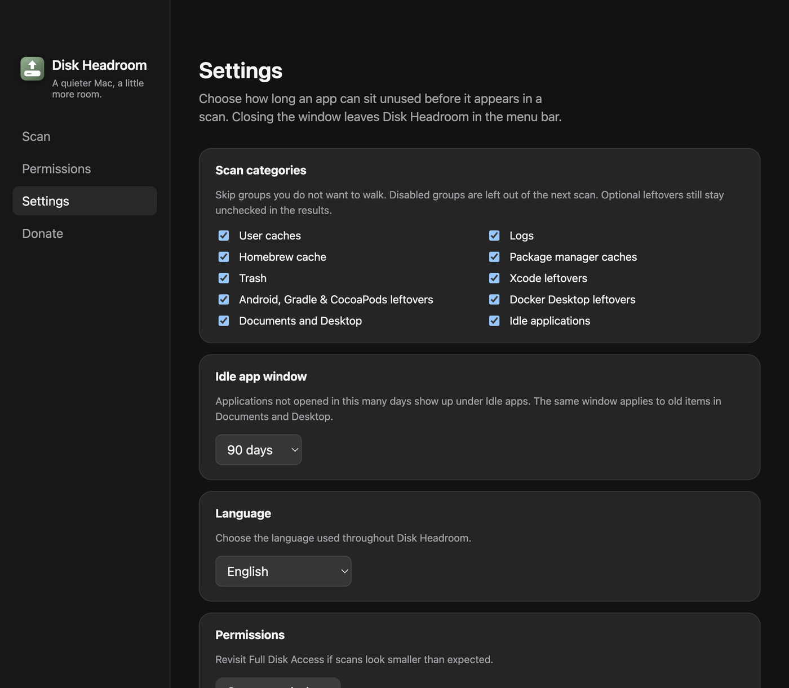

# Toggles por categoria no scan

- **Data:** 2026-08-31
- **Commit / PR:** [#38](https://github.com/nettonucci/diskheadroom/pull/38)
- **Tipo:** feat
- **Público:** quem só quer caches, quem não usa Xcode/Docker, quem acha apps inativos lentos
- **Formato sugerido no Instagram:** único (screenshot de Ajustes com as categorias)

## O que mudou

- Em Ajustes dá para ligar ou desligar cada grupo do scan.
- Grupos desligados não são percorridos na próxima verificação — apps inativos pulam Spotlight/`mdls`.
- O padrão continua o de hoje: todas as categorias entram no scan; leftovers opcionais seguem desmarcados nos resultados.
- A escolha fica em `settings.json` e sobrevive ao reabrir o app.
- O período de inatividade continua valendo quando apps inativos (e Documents/Desktop) estão ligados.

## Por que importa

Quem só quer caches não precisa esperar o Mac inteiro, inclusive apps que você não abriu há meses.

## Legenda pronta (PT-BR)

O scan não precisa olhar tudo.

Em Ajustes você escolhe o que o Disk Headroom percorre: caches, logs, Homebrew, Xcode, Docker, apps inativos.

Desligou apps inativos? Essa fase lenta fica de fora.

O padrão não muda: revisão manual, leftovers de desenvolvedor desmarcados, envio para a Lixeira.

Baixe o DMG nas Releases do GitHub.

#DiskHeadroom #macOS #SSD #UX #OpenSource #MacApps #Lixeira #Produtividade #Xcode #Docker

## Hashtags

`#DiskHeadroom` `#macOS` `#SSD` `#UX` `#OpenSource` `#MacApps` `#Lixeira` `#Produtividade` `#Xcode` `#Docker`

## Imagens

1. Tela de Ajustes com as categorias do scan

