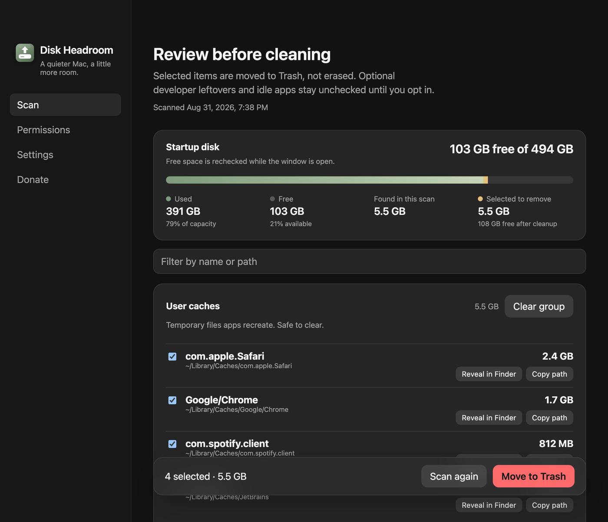

# Horário do scan e falhas visíveis

- **Data:** 2026-08-31
- **Commit / PR:** (preencher após o commit)
- **Tipo:** melhoria de UI
- **Público:** quem revisa o que o scan achou e o que foi para a Lixeira
- **Formato sugerido no Instagram:** único (screenshot de resultados com o horário)

## O que mudou

- A tela de resultados mostra **quando** o scan rodou.
- Se o scan quebrar, aparece um aviso e o botão de tentar de novo — a UI não fica travada em silêncio.
- Depois de mover para a Lixeira, itens que falharam aparecem com o caminho, não só um número.
- O aviso de Acesso Total ao Disco limitado continua igual.

## Por que importa

Dá para saber se a lista é recente, se o scan falhou e quais caminhos não foram para a Lixeira.

## Legenda pronta (PT-BR)

O scan acabou. Mas quando? E se um arquivo não foi para a Lixeira?

Agora os resultados mostram o horário da verificação.

Se algo der errado, o app avisa. Se um item não mover, o caminho aparece na lista.

Revisão manual. Nada some sozinho.

#DiskHeadroom #macOS #SSD #UX #OpenSource #MacApps #Lixeira #Produtividade

## Hashtags

`#DiskHeadroom` `#macOS` `#SSD` `#UX` `#OpenSource` `#MacApps` `#Lixeira` `#Produtividade`

## Imagens

1. Tela de resultados com o horário do scan abaixo da descrição

