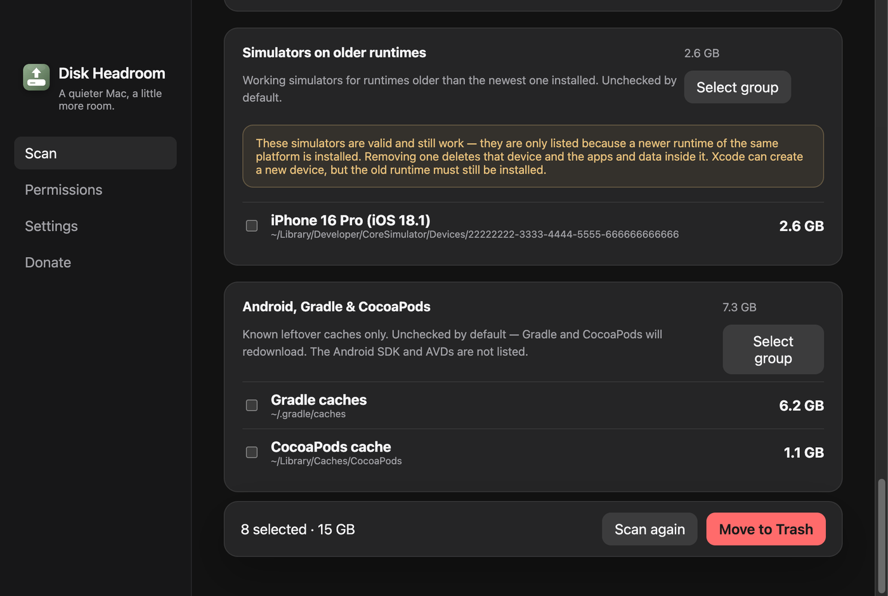

# Leftovers do Xcode + uso honesto do disco

- **Data:** 2026-08-31
- **Commit / PR:** `ae72f07` / [#28](https://github.com/nettonucci/diskheadroom/issues/28)
- **Tipo:** feat
- **Público:** quem desenvolve iOS/macOS com Xcode
- **Formato sugerido no Instagram:** carrossel (developer + scan)

## O que mudou

- Além de DerivedData: iOS DeviceSupport, Archives, caches do CoreSimulator.
- Simuladores indisponíveis (runtime desinstalado).
- Simuladores em runtimes **mais antigos** que o mais novo instalado — ainda funcionam; aviso de que apagar o device apaga apps e dados nele.
- Tudo **desmarcado** até você optar.
- Relato de disco alinhado ao APFS (o número de “livre” combina melhor com o que o Finder mostra).

## Por que importa

Xcode deixa DerivedData, símbolos de device e simuladores velhos ocupando dezenas de GB. Agora isso entra no scan, com opt-in e aviso quando o simulador ainda é válido.

## Legenda pronta (PT-BR)

Xcode é ótimo em deixar resto.

DerivedData, DeviceSupport, Archives, caches de simulador, devices de runtime antigo.

O Disk Headroom lista isso. Tudo desmarcado.

Simulador de runtime velho ainda funciona — a gente avisa. Remover o device apaga os apps e os dados dele.

E o número de espaço livre agora fala a língua do APFS, mais perto do que o Finder mostra.

Você marca. Confirma. Lixeira.

#DiskHeadroom #Xcode #iOSDev #macOS #Swift #CoreSimulator #SSD #AppleDeveloper

## Hashtags

`#DiskHeadroom` `#Xcode` `#iOSDev` `#macOS` `#Swift` `#CoreSimulator` `#SSD` `#AppleDeveloper`

## Imagens

1. Grupos de desenvolvedor (simuladores e caches)
2. Painel de disco no scan

