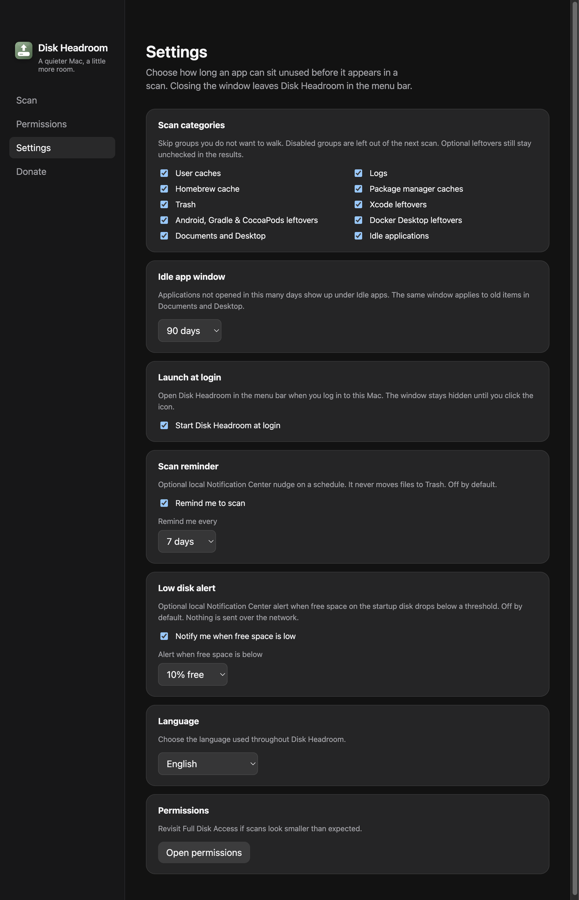
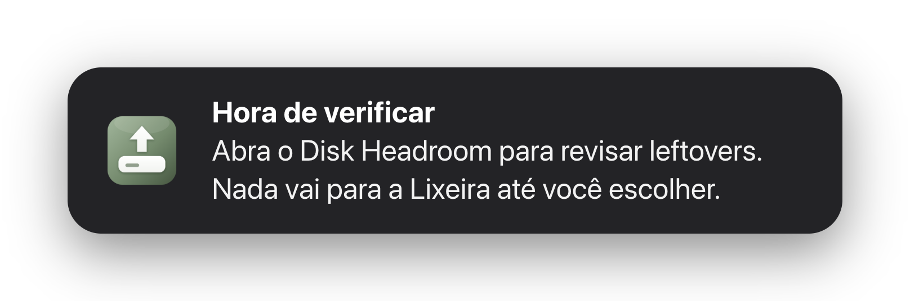
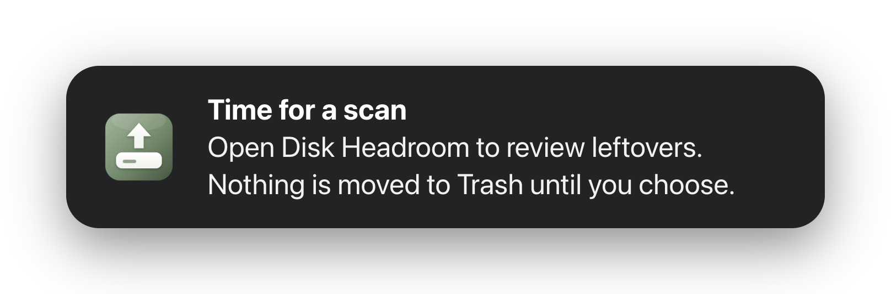

# Abrir ao entrar no Mac e lembrete de scan

- **Data:** 2026-09-01
- **Commit / PR:** issue [#15](https://github.com/nettonucci/diskheadroom/issues/15)
- **Tipo:** feat
- **Público:** quem já deixa o Disk Headroom na barra de menus e quer o hábito de revisar, sem limpeza automática
- **Formato sugerido no Instagram:** carrossel (1. Ajustes com os novos toggles, 2. aviso de lembrete)

## O que mudou

- Em Ajustes dá para ligar **abrir ao entrar no Mac**. O app sobe na barra de menus; a janela fica oculta até você clicar no ícone.
- Há um **lembrete de verificação** opcional (7, 14 ou 30 dias) no Centro de Notificações.
- O lembrete **nunca** envia arquivos para a Lixeira. Só avisa para abrir e revisar.
- Desligado por padrão. Inglês, português e espanhol.

## Por que importa

Fechar a janela já deixava o app na barra de menus. Agora dá para ele voltar no login e lembrar de um scan — sem virar um “limpador milagre”.

## Legenda pronta (PT-BR)

O Disk Headroom já vive na barra de menus.

Agora você pode abrir ao entrar no Mac e ligar um lembrete de verificação (semanal, a cada 14 dias ou no mês).

É só um aviso. Nada vai para a Lixeira até você revisar e confirmar.

Desligado por padrão. Local. Sem rede.

Baixe o DMG nas Releases do GitHub.

#DiskHeadroom #macOS #SSD #MenuBar #Notificacoes #OpenSource #MacApps #Lixeira #Produtividade #Armazenamento

## Hashtags

`#DiskHeadroom` `#macOS` `#SSD` `#MenuBar` `#Notificacoes` `#OpenSource` `#MacApps` `#Lixeira` `#Produtividade` `#Armazenamento`

## Imagens

1. Ajustes com abrir ao login e lembrete ligados

2. O lembrete como ele chega no Centro de Notificações

Mesmo aviso em inglês, para posts ou material em `en`:

> `notificacao.png` e `notification-en.png` são reproduções do banner geradas por
> `npm run screenshots:notification -- --locale=pt-BR|en --kind=scanReminder`.
> O macOS não deixa um script capturar a notificação real.
