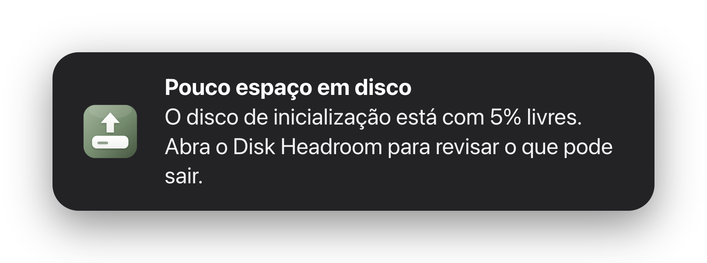
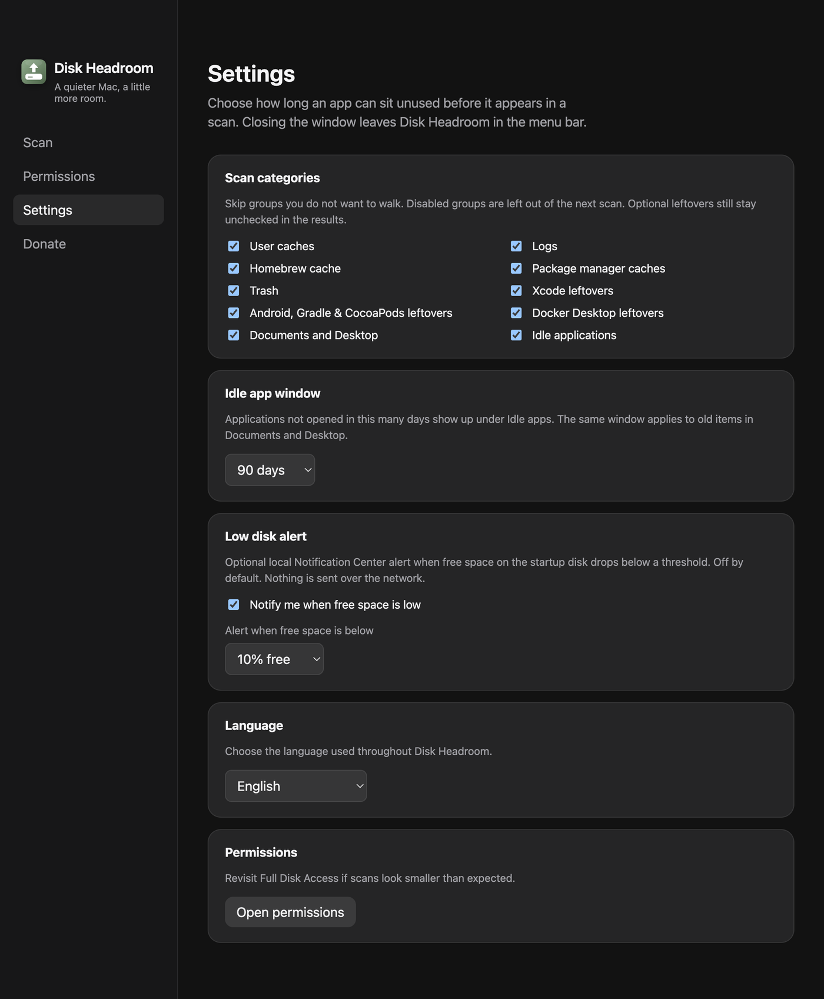
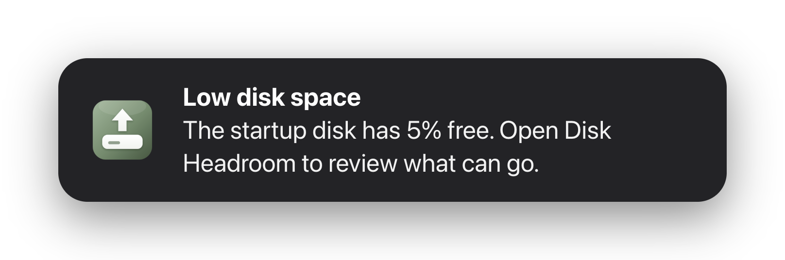

# Alerta local de disco cheio

- **Data:** 2026-09-01
- **Commit / PR:** (esta task)
- **Tipo:** feat
- **Público:** quem deixa o Mac no limite e só percebe o disco cheio tarde demais
- **Formato sugerido no Instagram:** carrossel (1. banner do aviso, 2. tela de Ajustes)

## O que mudou

- Em Ajustes dá para ligar um aviso local no Centro de Notificações quando o espaço livre cai abaixo de um limite.
- O padrão é **desligado**. O limiar conservador é 10% livres; também dá para escolher 5% / 15% ou 5 / 10 / 20 GB.
- O aviso sai do processo principal, sem rede e sem analytics. Há um intervalo de 12 horas para não repetir o alerta.
- Clicar na notificação abre a janela do Disk Headroom.
- O macOS pede permissão de notificação quando o sistema exige.

## Por que importa

Disco cheio aparece tarde. Um aviso local na barra de menus avisa antes de o Mac travar em atualização, export ou build.

## Legenda pronta (PT-BR)

Disco cheio a gente só percebe tarde.

No Disk Headroom você pode ligar um aviso local quando o espaço livre cair abaixo de 10% (ou de alguns GB).

Desligado por padrão. Sem rede. Sem spam: no máximo de novo depois de 12 horas.

Clicou no aviso? Abre o app para revisar o que pode ir para a Lixeira.

Baixe o DMG nas Releases do GitHub.

#DiskHeadroom #macOS #SSD #Notificacoes #OpenSource #MacApps #Lixeira #Produtividade #Armazenamento #MenuBar

## Hashtags

`#DiskHeadroom` `#macOS` `#SSD` `#Notificacoes` `#OpenSource` `#MacApps` `#Lixeira` `#Produtividade` `#Armazenamento` `#MenuBar`

## Imagens

1. O aviso como ele chega no Centro de Notificações

2. Tela de Ajustes com o alerta de disco ligado

Mesmo aviso em inglês, para posts ou material em `en`:

> `notificacao.png` e `notification-en.png` são reproduções do banner geradas por
> `npm run screenshots:notification -- --locale=pt-BR|en --percent=5` (ícone e textos vindos
> do app). O macOS não deixa um script capturar a notificação real, e o percentual mostrado
> é escolhido no comando.
