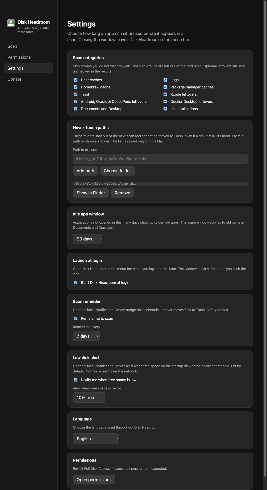

# Lista never-touch e lixeira só do último scan

- **Data:** 2026-09-02
- **Commit / PR:** #59
- **Tipo:** feat
- **Público:** quem já usa o Disk Headroom e quer proteger pastas (caches de projeto, apps idle) sem mudar o fluxo de revisão
- **Formato sugerido no Instagram:** carrossel

## O que mudou

- Em Ajustes, dá para colar um caminho ou escolher uma pasta que o scan **não lista**.
- Esses caminhos também **não vão para a Lixeira**, mesmo se algo ainda tentar enviá-los.
- A lixeira só aceita itens do **último scan** — paths inventados pelo renderer são recusados.
- A lista fica só neste Mac (`settings.json`). `en`, `pt-BR` e `es`.

## Por que importa

O app continua conservador: você revisa, envia para a Lixeira, e agora pode marcar o que nunca deve ser tocado.

## Legenda pronta (PT-BR)

O Disk Headroom agora deixa você marcar pastas intocáveis.

Caches de um projeto, um app idle que você quer manter, um caminho que não deve aparecer no scan — cola o path ou escolhe a pasta em Ajustes.

Na próxima verificação, esses itens ficam de fora. E a Lixeira só aceita o que o último scan mostrou. Sem milagre, sem apagar fora da revisão.

Baixe o DMG nas GitHub Releases. Estrela ajuda. Sponsor também.

## Hashtags

#DiskHeadroom #macOS #SSD #LimpezaDeDisco #Privacidade #OpenSource #DeveloperTools #MacApps #Lixeira #Ajustes

## Imagens

1. `imagens/settings.png` — card Never-touch paths em Ajustes, com um caminho de exemplo e os botões Show in Finder / Remove.

