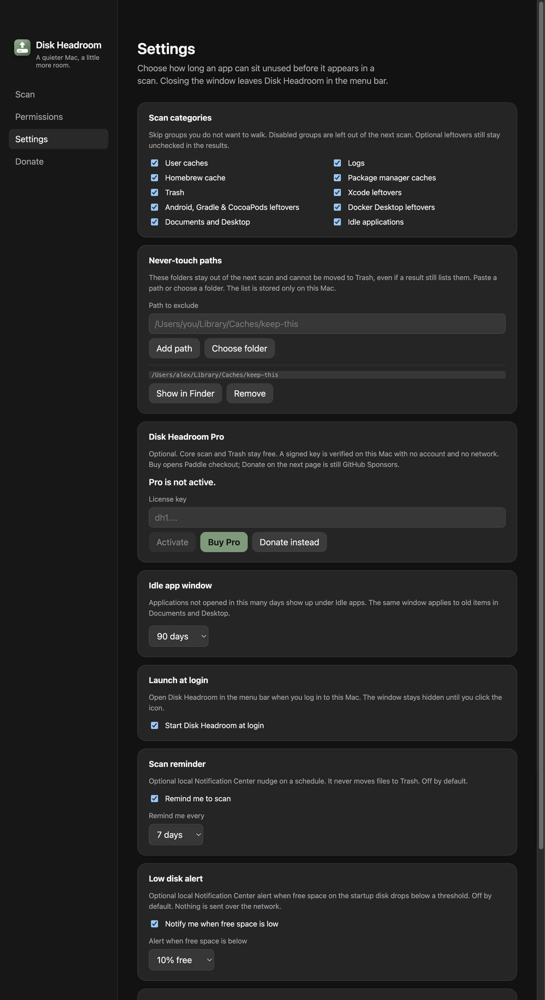

# Pro: colar chave e abrir a Paddle

- **Data:** 2026-09-02
- **Commit / PR:** #42 #43
- **Tipo:** feat
- **Público:** quem já usa o scan grátis e pode querer Pro depois; quem só doa no GitHub Sponsors
- **Formato sugerido no Instagram:** carrossel

## O que mudou

- Em Ajustes, seção **Disk Headroom Pro**: colar a chave, ver se é válida, comprar (Paddle).
- Scan e Lixeira continuam iguais **sem** chave.
- Doar / GitHub Sponsors permanece na barra e na tela Donate.
- A chave é verificada neste Mac, sem conta e sem rede. `en`, `pt-BR`, `es`.

## Por que importa

O app continua local e opcional: quem não compra Pro não perde o fluxo conservador.

## Legenda pronta (PT-BR)

O Disk Headroom ganhou um lugar para ativar o Pro.

Cola a chave em Ajustes. Se for válida, o app marca Pro neste Mac — offline, sem conta. Comprar abre o checkout da Paddle. Quem só quer apoiar o app grátis continua no Donate / GitHub Sponsors.

Scan, revisão e Lixeira seguem iguais sem pagar. Sem milagre, sem telemetria.

Baixe o DMG nas GitHub Releases. Estrela ajuda. Sponsor também.

## Hashtags

#DiskHeadroom #macOS #SSD #Electron #indiehackers #opensource #MacApps #Paddle

## Imagens

1. `imagens/settings.png` — Ajustes com a seção Pro (colar chave, Comprar, Doar).

