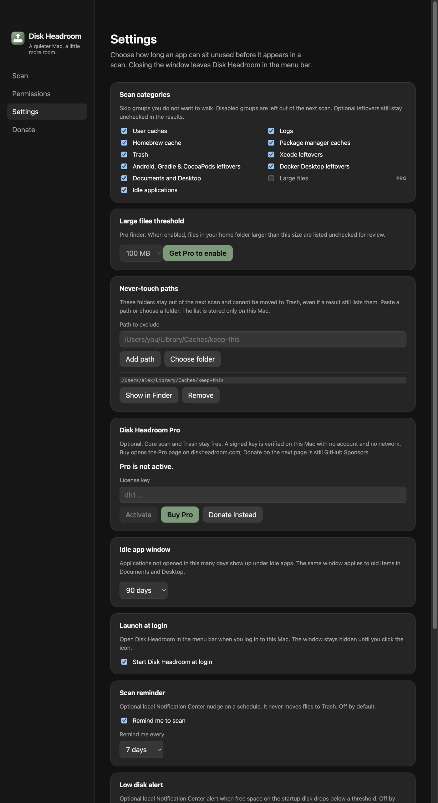

# Finder Pro de arquivos grandes

- **Data:** 2026-09-03
- **Commit / PR:** #50
- **Tipo:** feat
- **Público:** pessoas que precisam localizar arquivos grandes no Mac sem varrer o disco inteiro
- **Formato sugerido no Instagram:** carrossel

## O que mudou

- Nova categoria visível e opt-in para localizar arquivos grandes dentro da pasta pessoal.
- Recurso disponível com licença Disk Headroom Pro válida, verificada offline no processo principal.
- Limite configurável entre 100 MB e 5 GB.
- Busca limitada por profundidade, quantidade de pastas e resultados; links simbólicos e caminhos protegidos são ignorados.
- Resultados ficam desmarcados por padrão para revisão manual.
- A remoção continua sendo somente para a Lixeira.

## Por que importa

Ajuda a encontrar os maiores arquivos pessoais com limites seguros, revisão manual e sem apagar nada diretamente.

## Legenda pronta (PT-BR)

O Disk Headroom Pro agora encontra arquivos grandes na sua pasta pessoal. 🔎

Você escolhe o tamanho mínimo, ativa a categoria e revisa cada resultado — todos começam desmarcados. A busca tem limites de profundidade e quantidade, ignora links simbólicos e caminhos protegidos, e qualquer remoção vai somente para a Lixeira.

A licença é validada offline no Mac, sem conta e sem consulta à rede.

Baixe o DMG no GitHub Releases, deixe uma estrela e, se o app ajuda no seu dia a dia, considere apoiar o projeto.

## Hashtags

#macOS #Mac #DiskSpace #Storage #OpenSource #Electron #TypeScript #DeveloperTools #Productivity #DiskHeadroom

## Imagens

1. `imagens/settings.png` — Ajustes com a categoria e o limite de arquivos grandes, identificados como Pro.

