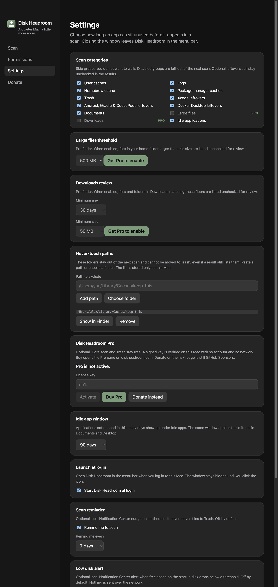
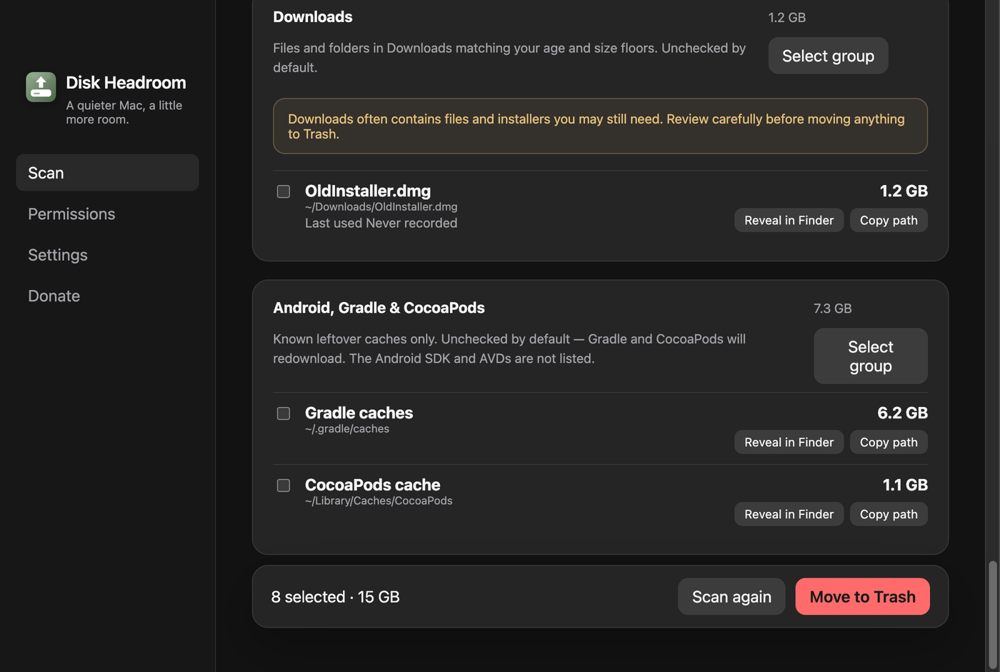

# Revisão Pro de Downloads

- **Data:** 2026-09-03
- **Commit / PR:** #19 / #51
- **Tipo:** feat
- **Público:** quem acumula instaladores e arquivos velhos em Downloads
- **Formato sugerido no Instagram:** carrossel

## O que mudou

- Nova categoria visível e opt-in para revisar arquivos e pastas antigos ou grandes em `~/Downloads`.
- Recurso disponível com licença Disk Headroom Pro válida, verificada offline no processo principal.
- Limites configuráveis de idade (qualquer idade até 365 dias) e tamanho (qualquer tamanho até 1 GB), com padrão conservador de 30 dias e 50 MB.
- A pasta Downloads em si não vai para a Lixeira; só itens dentro dela. Links simbólicos, `.DS_Store` e `.localized` ficam de fora.
- No máximo 50 resultados, ordenados do maior para o menor, todos desmarcados por padrão.
- O grupo de itens ociosos nos resultados passa a se chamar Documents. A pasta Downloads tem grupo próprio; a mesa (Desktop) continua listada neste grupo, e o aviso deixa isso explícito.
- A remoção continua sendo somente para a Lixeira.

## Por que importa

Ajuda a limpar Downloads sem varrer a pasta inteira de uma vez, com revisão manual e aviso de que instaladores ainda podem ser necessários.

## Legenda pronta (PT-BR)

O Disk Headroom Pro agora revisa arquivos velhos e grandes na pasta Downloads. 📥

Você escolhe idade e tamanho mínimos, ativa a categoria e confere cada item — todos começam desmarcados. A pasta Downloads em si não entra na Lixeira; só o que você marcar. Links simbólicos ficam de fora, e a lista para em 50 itens.

A licença é validada offline no Mac, sem conta e sem consulta à rede.

Baixe o DMG no GitHub Releases, deixe uma estrela e, se o app ajuda no seu dia a dia, considere apoiar o projeto.

## Hashtags

#macOS #Mac #DiskSpace #Storage #Downloads #OpenSource #Electron #TypeScript #Productivity #DiskHeadroom

## Imagens

1. `imagens/settings.png` — Ajustes com a categoria Downloads e os limites de idade/tamanho, identificados como Pro.

2. `imagens/resultados.png` — Resultado desmarcado, com aviso de que Downloads pode ter instaladores ainda necessários.

