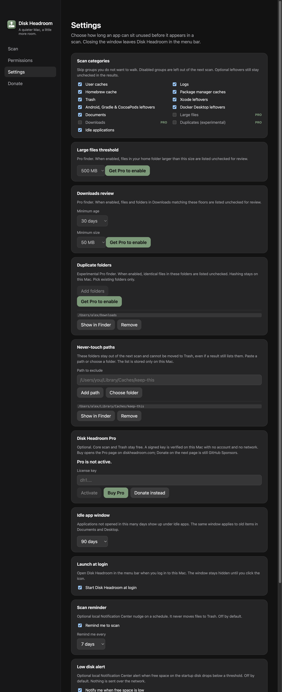
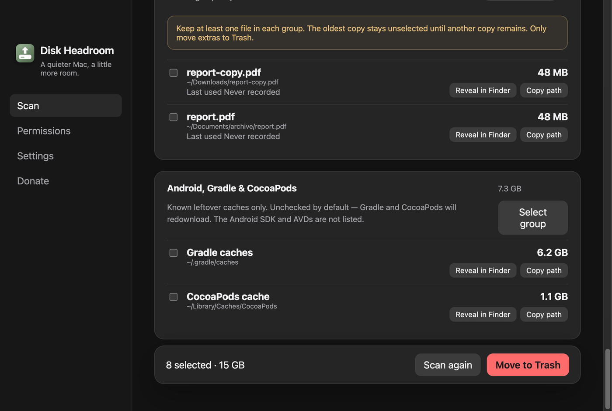

# Finder Pro experimental de duplicatas

- **Data:** 2026-09-05
- **Commit / PR:** #20
- **Tipo:** feat
- **Público:** quem tem cópias iguais em Downloads ou pastas de projeto e quer revisar antes de limpar
- **Formato sugerido no Instagram:** carrossel

## O que mudou

- Nova categoria experimental e opt-in para encontrar arquivos idênticos só nas pastas que você escolhe em Ajustes.
- Recurso Disk Headroom Pro, com a licença verificada offline no processo principal. Sem pastas escolhidas, o finder não varre nada.
- Detecção em duas fases: agrupa por tamanho e calcula SHA-256 em stream só nos candidatos.
- Em cada grupo, pelo menos uma cópia permanece. A mais antiga fica de fora até restar outra; a Lixeira recusa esvaziar o grupo.
- Limites de profundidade, pastas e arquivos; ignora links simbólicos, arquivos vazios, caminhos de sistema e a lista de intocáveis.
- A remoção continua sendo somente para a Lixeira. Nenhum nome de arquivo sai deste Mac.

## Por que importa

Encontra cópias iguais sem hashear o disco inteiro, com revisão manual e a regra de manter uma cópia de verdade.

## Legenda pronta (PT-BR)

O Disk Headroom Pro agora encontra duplicatas nas pastas que você escolher. 🧬

É experimental e opt-in: você aponta pastas existentes, liga a categoria e revisa o grupo. O app compara tamanho e hash localmente. Pelo menos uma cópia de cada arquivo fica — a mais antiga permanece desmarcada até restar outra. O que você confirmar vai só para a Lixeira.

A licença é validada offline no Mac, sem conta e sem consulta à rede.

Baixe o DMG no GitHub Releases, deixe uma estrela e, se o app ajuda no seu dia a dia, considere apoiar o projeto.

## Hashtags

#macOS #Mac #DiskSpace #Storage #Duplicates #OpenSource #Electron #TypeScript #Productivity #DiskHeadroom

## Imagens

1. `imagens/settings.png` — Ajustes com a categoria experimental, o seletor de pastas e o CTA do Pro.

2. `imagens/resultados.png` — Grupo de duplicatas desmarcado, com o aviso de manter pelo menos uma cópia.

