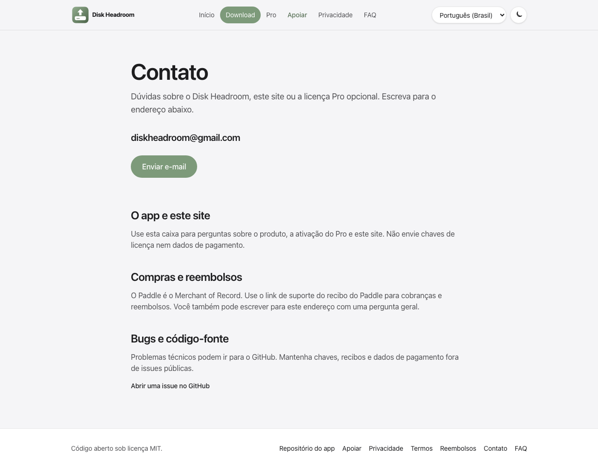

# Página de contato no site

- **Data:** 2026-09-05
- **Commit / PR:** diskheadroom-web (página `/contato`)
- **Tipo:** melhoria de UI
- **Público:** quem precisa falar com o projeto, inclusive compradores do Pro
- **Formato sugerido no Instagram:** único

## O que mudou

- O site ganhou a página Contato em português, inglês e espanhol.
- O endereço publicado é `diskheadroom@gmail.com`, com atalho de e-mail.
- O link aparece no rodapé e junto ao checkout do Pro.
- Compras e reembolsos continuam no Paddle; bugs técnicos podem ir para o GitHub.

## Por que importa

Quem tem dúvida sobre o app, o Pro ou o site agora tem um canal claro, sem misturar chave de licença e dados de pagamento.

## Legenda pronta (PT-BR)

Precisa falar com o Disk Headroom? Agora tem um endereço.

O site publica a página Contato com o e-mail diskheadroom@gmail.com. Dá para
perguntar sobre o app, a licença Pro ou o site. Cobrança e reembolso seguem
pelo recibo do Paddle; bugs de código podem ir para o GitHub.

O app continua gratuito, local e de código aberto. O Pro é opcional.

Baixe o DMG nas Releases do GitHub e revise cada item antes de mandar para a
Lixeira.

#DiskHeadroom #macOS #MacApp #OpenSource #Privacidade #SoftwareIndie
#AppleSilicon #Desenvolvimento

## Hashtags

#DiskHeadroom #macOS #MacApp #OpenSource #Privacidade #SoftwareIndie
#AppleSilicon #Desenvolvimento

## Imagens

1. `imagens/contato-pt-br.png` — página Contato em português, com o e-mail visível.

