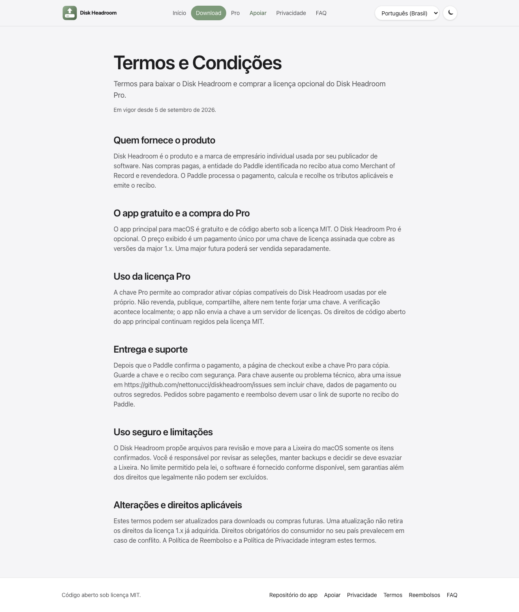
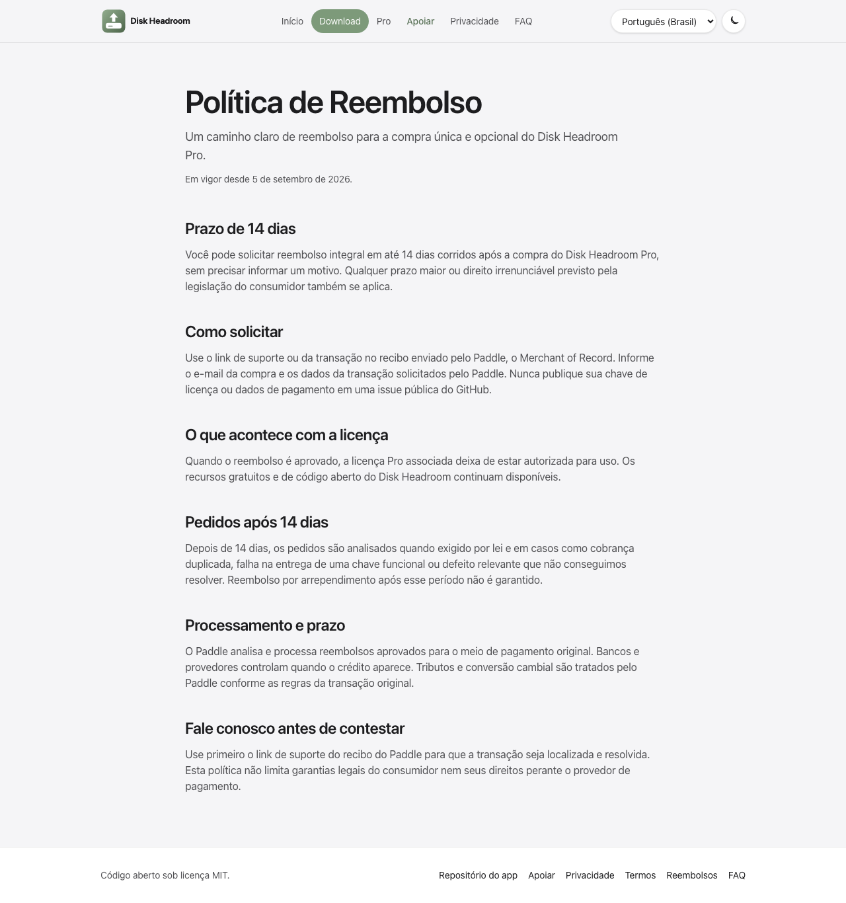

# Termos e reembolso transparentes para o Pro

- **Data:** 2026-09-05
- **Commit / PR:** diskheadroom-web `b97f50d`
- **Tipo:** melhoria de UI
- **Público:** quem considera comprar o Disk Headroom Pro
- **Formato sugerido no Instagram:** carrossel

## O que mudou

- O site agora publica Termos e Condições em português, inglês e espanhol.
- A política oferece reembolso integral em até 14 dias corridos.
- O checkout identifica o Paddle como Merchant of Record.
- Termos, reembolso e privacidade ficam visíveis no rodapé e junto à compra.
- A licença continua sendo pagamento único para todas as versões 1.x.

## Por que importa

Quem compra o Pro sabe antes do pagamento o que recebe, quem processa a
transação e como pedir reembolso.

## Legenda pronta (PT-BR)

Comprar software deve ser simples — inclusive se você mudar de ideia.

O site do Disk Headroom Pro agora deixa Termos, Privacidade e Política de
Reembolso visíveis antes da compra. A licença é um pagamento único para a
major 1.x, o Paddle processa a transação como Merchant of Record e pedidos de
reembolso integral podem ser feitos em até 14 dias.

O app gratuito continua gratuito e de código aberto. O Pro é opcional.

Baixe o DMG nas Releases do GitHub e revise cada item antes de mandar para a
Lixeira.

#DiskHeadroom #macOS #MacApp #OpenSource #Privacidade #SoftwareIndie
#AppleSilicon #Desenvolvimento

## Hashtags

#DiskHeadroom #macOS #MacApp #OpenSource #Privacidade #SoftwareIndie
#AppleSilicon #Desenvolvimento

## Imagens

1. `imagens/termos-pt-br.png` — página de Termos e Condições em português.
2. `imagens/reembolso-pt-br.png` — política de reembolso com prazo de 14 dias.

