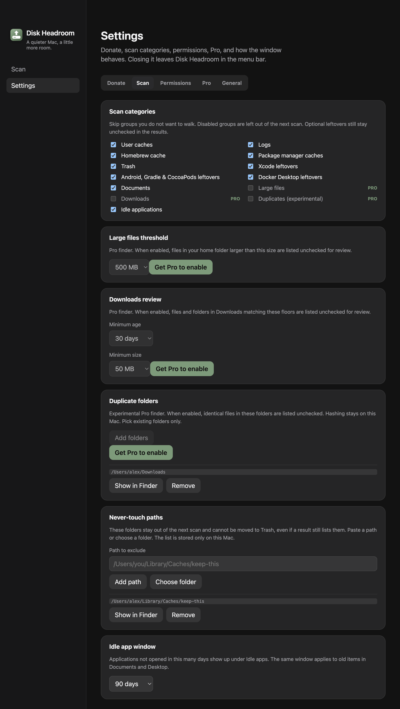
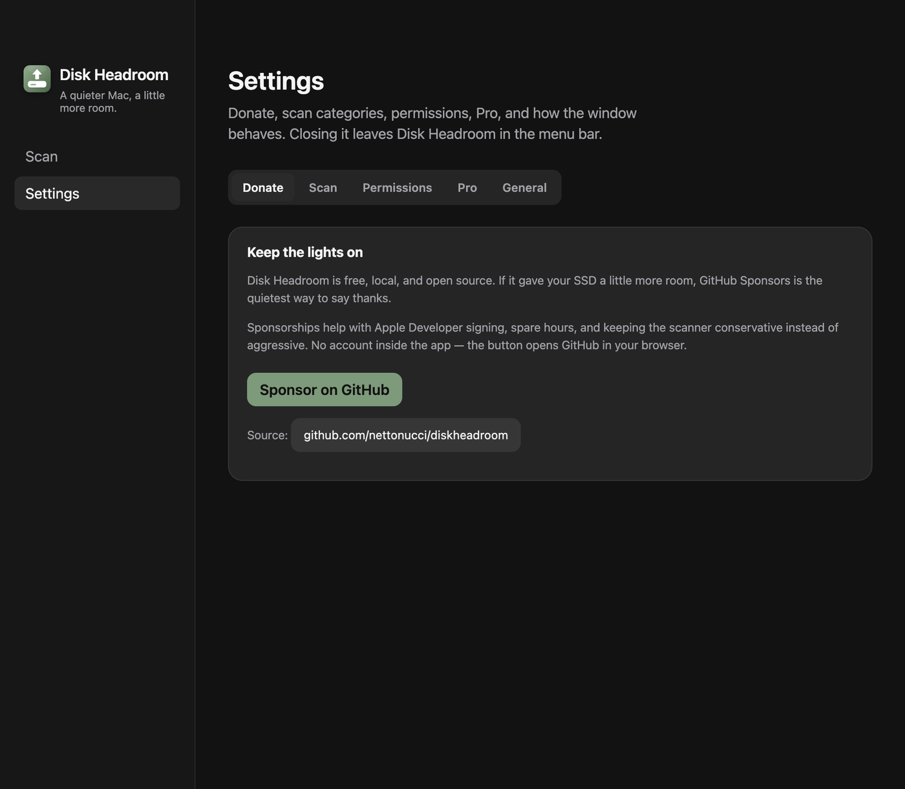

# Aba Doar em Ajustes

- **Data:** 2026-09-06
- **Commit / PR:** —
- **Tipo:** melhoria de UI
- **Público:** quem quer apoiar o app sem misturar com a chave Pro
- **Formato sugerido no Instagram:** carrossel (1. as cinco abas, 2. aba Donate)

## O que mudou

- GitHub Sponsors saiu da aba Pro e ganhou a aba **Donate** em Ajustes: primeira da barra e a que abre por padrão.
- Pro fica só com a licença. Doar continua no mesmo card “Keep the lights on”, agora no próprio painel.
- O botão “Donate instead” na aba Pro abre a aba Donate.
- Menu da bandeja Donate e o primeiro atalho de patrocínio caem nessa aba.

## Por que importa

Licença paga e apoio via Sponsor são coisas diferentes. Cada uma tem o próprio lugar na barra de Ajustes.

## Legenda pronta (PT-BR)

Doar no Disk Headroom agora tem aba própria.

Doar, Scan, Permissões, Pro e Geral. Sponsors no GitHub, sem misturar com a chave Pro.

O scan continua o mesmo: você revisa e manda só o que quiser para a Lixeira.

Baixe o DMG nas Releases do GitHub.

#DiskHeadroom #macOS #SSD #OpenSource #GitHubSponsors #Ajustes #MacApps #Electron #Armazenamento #Produtividade

## Hashtags

`#DiskHeadroom` `#macOS` `#SSD` `#OpenSource` `#GitHubSponsors` `#Ajustes` `#MacApps` `#Electron` `#Armazenamento` `#Produtividade`

## Imagens

1. Ajustes com cinco abas, Donate na primeira posição

2. Aba Donate com o card Keep the lights on

