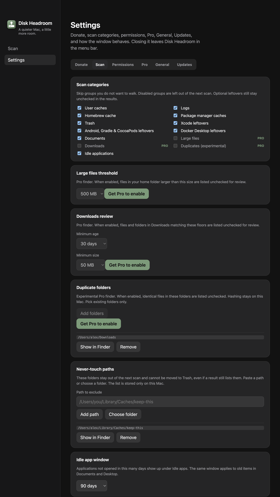
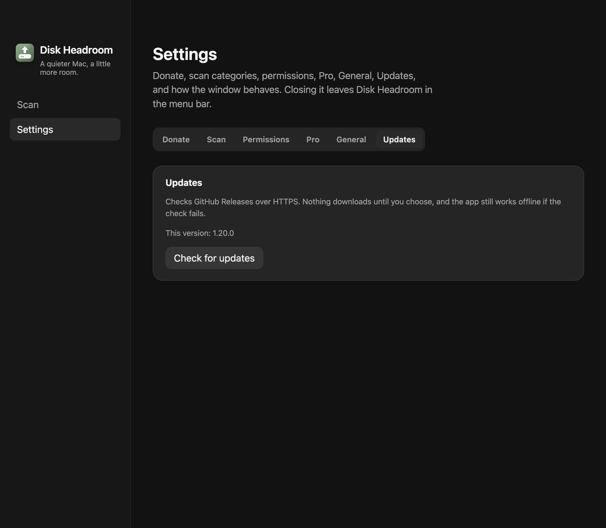

# Aba Atualizações em Ajustes

- **Data:** 2026-09-06
- **Commit / PR:** —
- **Tipo:** melhoria de UI
- **Público:** quem procura atualizações e não quer rolar a aba Geral
- **Formato sugerido no Instagram:** carrossel (1. as seis abas, 2. aba Updates)

## O que mudou

- Checagem de GitHub Releases saiu da aba Geral e ganhou a aba **Updates** em Ajustes.
- Geral fica com login, lembrete, alerta de disco, aparência, atalhos e idioma.
- Nada baixa sozinho: Procurar, Baixar e Reiniciar continuam no mesmo card, agora no próprio painel.

## Por que importa

Atualizar o app é um assunto separado de aparência e idioma. Cada um tem o próprio lugar na barra de Ajustes.

## Legenda pronta (PT-BR)

Atualizações no Disk Headroom agora têm aba própria.

Doar, Scan, Permissões, Pro, Geral e Atualizações. Consulta as Releases do GitHub por HTTPS, e nada baixa até você escolher.

O scan continua o mesmo: você revisa e manda só o que quiser para a Lixeira.

Baixe o DMG nas Releases do GitHub.

#DiskHeadroom #macOS #SSD #Atualizacoes #Ajustes #OpenSource #MacApps #Electron #Armazenamento #Produtividade

## Hashtags

`#DiskHeadroom` `#macOS` `#SSD` `#Atualizacoes` `#Ajustes` `#OpenSource` `#MacApps` `#Electron` `#Armazenamento` `#Produtividade`

## Imagens

1. Ajustes com seis abas, Updates por último

2. Aba Updates com o card de GitHub Releases

