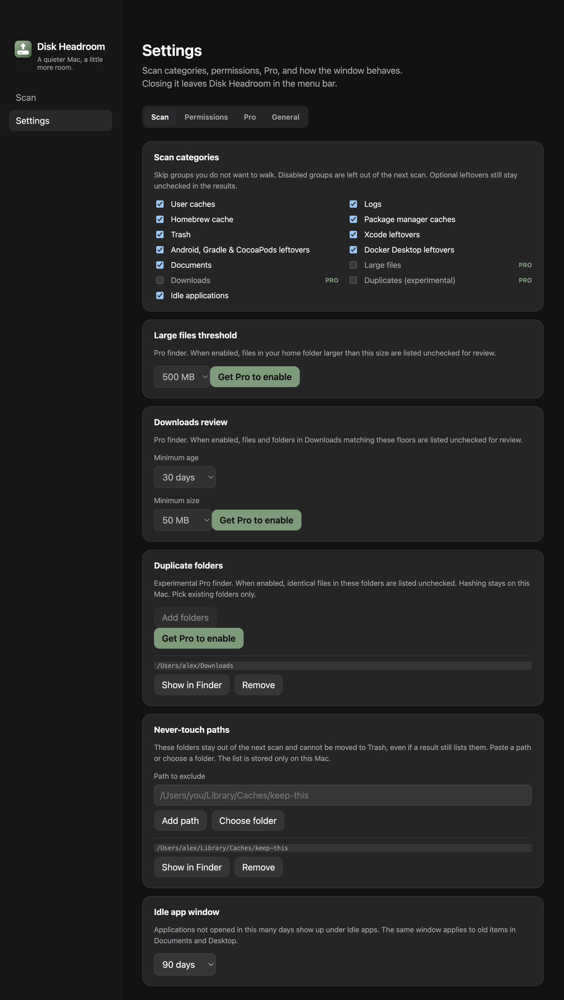
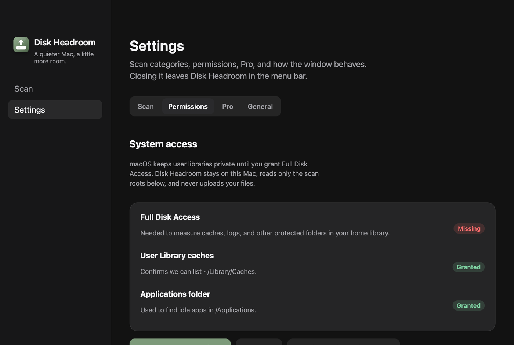
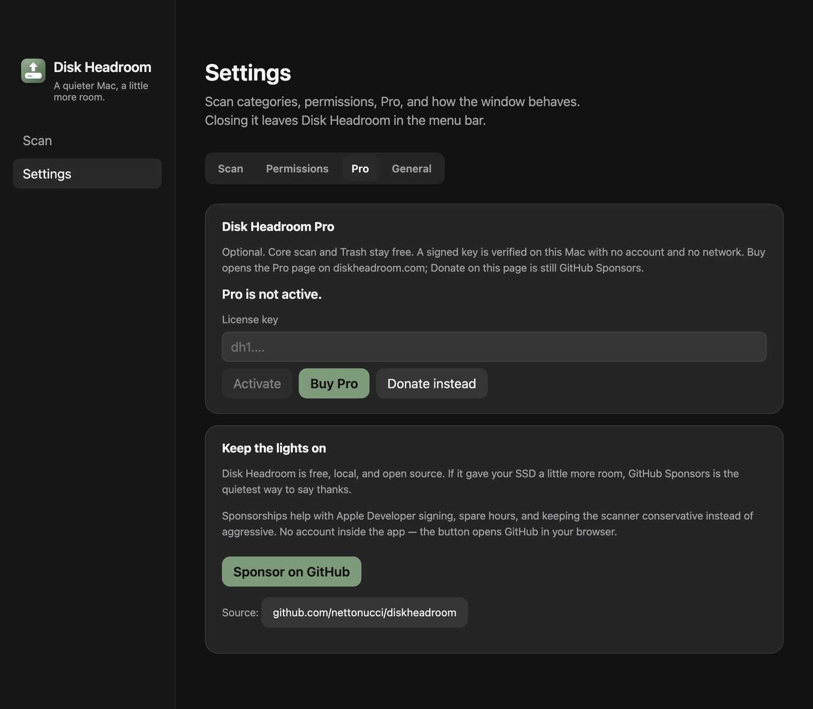

# Abas dentro de Ajustes

- **Data:** 2026-09-06
- **Commit / PR:** —
- **Tipo:** melhoria de UI
- **Público:** quem abre Ajustes e não quer uma página infinita
- **Formato sugerido no Instagram:** carrossel (1. aba Scan, 2. Permissões, 3. Pro)

## O que mudou

- Ajustes tem quatro abas: **Scan**, **Permissões**, **Pro** e **Geral**.
- Categorias, arquivos grandes, Downloads, duplicatas, caminhos intocáveis e o período de inatividade ficam em Scan.
- Full Disk Access fica em Permissões. Licença fica em Pro. GitHub Sponsors passou para a aba Donate (ver pacote seguinte).
- Login, lembrete, alerta de disco, aparência, atalhos, idioma e atualizações ficam em Geral.

## Por que importa

A barra ficou com duas seções. Sem abas, Ajustes virou um rolo só. Agora cada assunto tem o próprio painel.

## Legenda pronta (PT-BR)

Ajustes do Disk Headroom agora tem abas.

Scan, Permissões, Pro e Geral. Cada um no seu lugar, sem uma página que não acaba.

O scan e a Lixeira continuam iguais: você revisa antes de mover arquivos.

Baixe o DMG nas Releases do GitHub.

#DiskHeadroom #macOS #SSD #UX #Ajustes #OpenSource #MacApps #Electron #Armazenamento #Produtividade

## Hashtags

`#DiskHeadroom` `#macOS` `#SSD` `#UX` `#Ajustes` `#OpenSource` `#MacApps` `#Electron` `#Armazenamento` `#Produtividade`

## Imagens

1. Aba Scan em Ajustes

2. Aba Permissões no primeiro uso

3. Aba Pro (Sponsors saíram desta aba depois)

