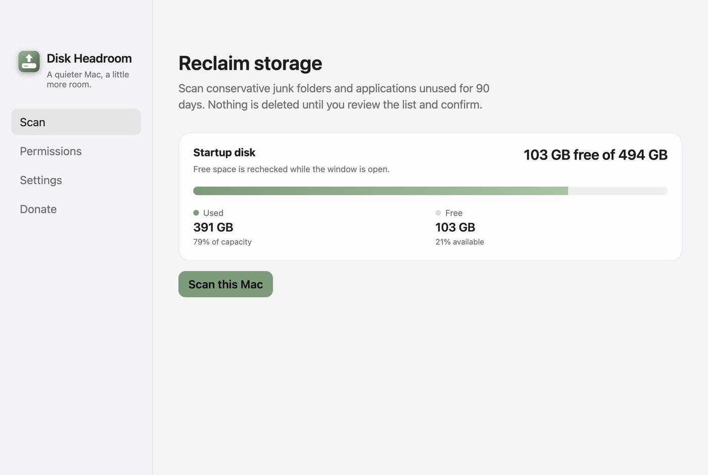
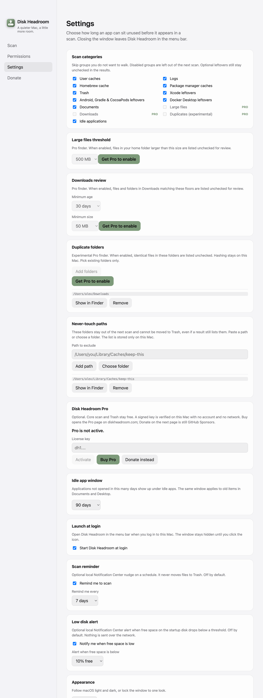

# Aparência clara e escura no macOS

- **Data:** 2026-09-06
- **Commit / PR:** #23
- **Tipo:** feat
- **Público:** quem usa o Mac em modo claro e via a janela só escura
- **Formato sugerido no Instagram:** carrossel (1. scan escuro, 2. scan claro, 3. Ajustes com o seletor)

## O que mudou

- A janela acompanha o claro e o escuro do macOS, ou você trava em um dos dois em Ajustes.
- Paleta clara usa os cinzas de sistema da Apple e o mesmo sage dos botões.
- Textos de status (ok, aviso, perigo) ficam mais escuros no claro para contraste.
- Inglês, português e espanhol. Scan e Lixeira não mudam.

## Por que importa

Quem deixa o Mac no modo claro deixa de ver uma janela escura no meio do resto do sistema.

## Legenda pronta (PT-BR)

O Disk Headroom agora segue o claro e o escuro do macOS.

Em Ajustes você escolhe Sistema, Escuro ou Claro. O padrão é acompanhar o Mac.

A janela usa os cinzas de sistema e o verde sage de sempre. Nada muda no scan nem na Lixeira: você continua revisando antes de mover arquivos.

Baixe o DMG nas Releases do GitHub.

#DiskHeadroom #macOS #SSD #ModoClaro #DarkMode #OpenSource #MacApps #Electron #Acessibilidade #Armazenamento

## Hashtags

`#DiskHeadroom` `#macOS` `#SSD` `#ModoClaro` `#DarkMode` `#OpenSource` `#MacApps` `#Electron` `#Acessibilidade` `#Armazenamento`

## Imagens

1. Scan no tema escuro (como era)

2. O mesmo painel no tema claro

3. Ajustes com o seletor de aparência

