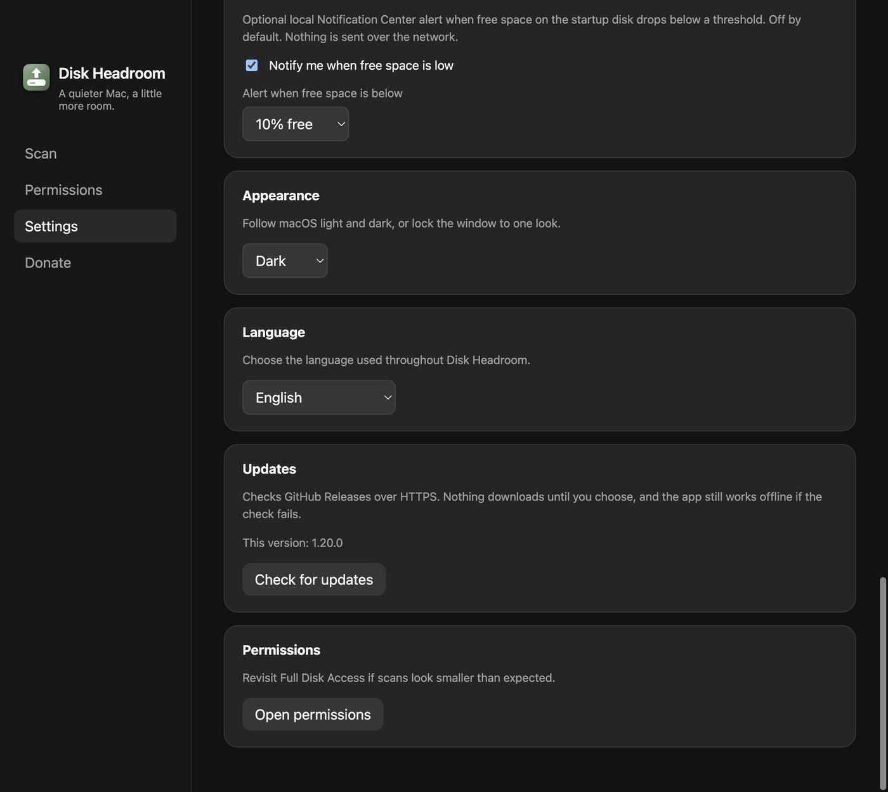
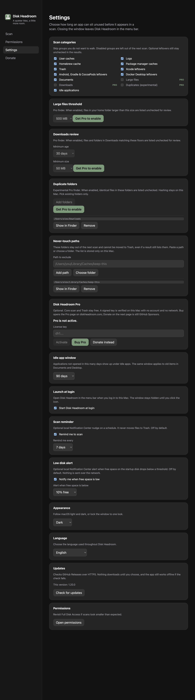

# Assinatura Apple e atualizações pelo GitHub

- **Data:** 2026-09-06
- **Commit / PR:** #67
- **Tipo:** feat
- **Público:** quem instala o DMG e quer atualizar sem baixar na mão
- **Formato sugerido no Instagram:** único (card de Atualizações em Ajustes)

## O que mudou

- Os DMGs publicados passam a ser assinados com Developer ID e notarizados no CI.
- Em Ajustes há um card para procurar atualizações nas Releases do GitHub, só por HTTPS.
- Nada é baixado nem instalado até você escolher. Se o GitHub estiver offline, o resto do app continua.
- Inglês, português e espanhol. Scan e Lixeira não mudam.

## Por que importa

O Gatekeeper deixa de exigir Open Anyway no build publicado, e você não precisa caçar o DMG novo a cada versão.

## Legenda pronta (PT-BR)

O Disk Headroom agora sai assinado e notarizado.

Em Ajustes você procura atualizações nas Releases do GitHub. Nada baixa sozinho, e o app continua funcionando se a checagem falhar.

Scan e Lixeira seguem iguais: você revisa, depois move o que quiser.

Baixe o DMG nas Releases do GitHub.

#DiskHeadroom #macOS #SSD #OpenSource #MacApps #Electron #Gatekeeper #Atualizacao #Privacidade #Armazenamento

## Hashtags

`#DiskHeadroom` `#macOS` `#SSD` `#OpenSource` `#MacApps` `#Electron` `#Gatekeeper` `#Atualizacao` `#Privacidade` `#Armazenamento`

## Imagens

1. Card de atualizações em Ajustes

2. Ajustes completo (referência)

