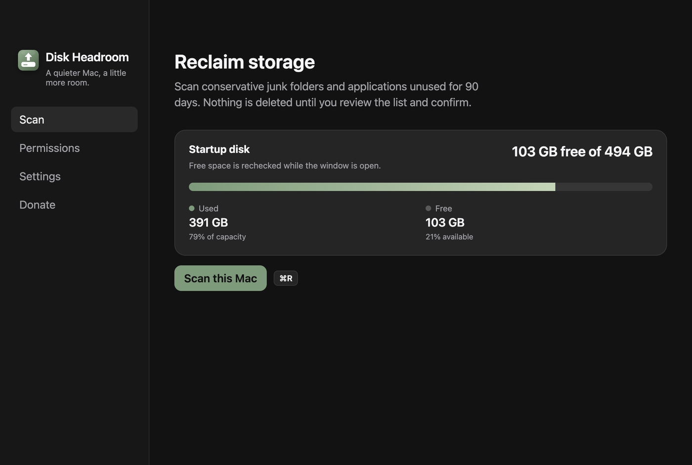
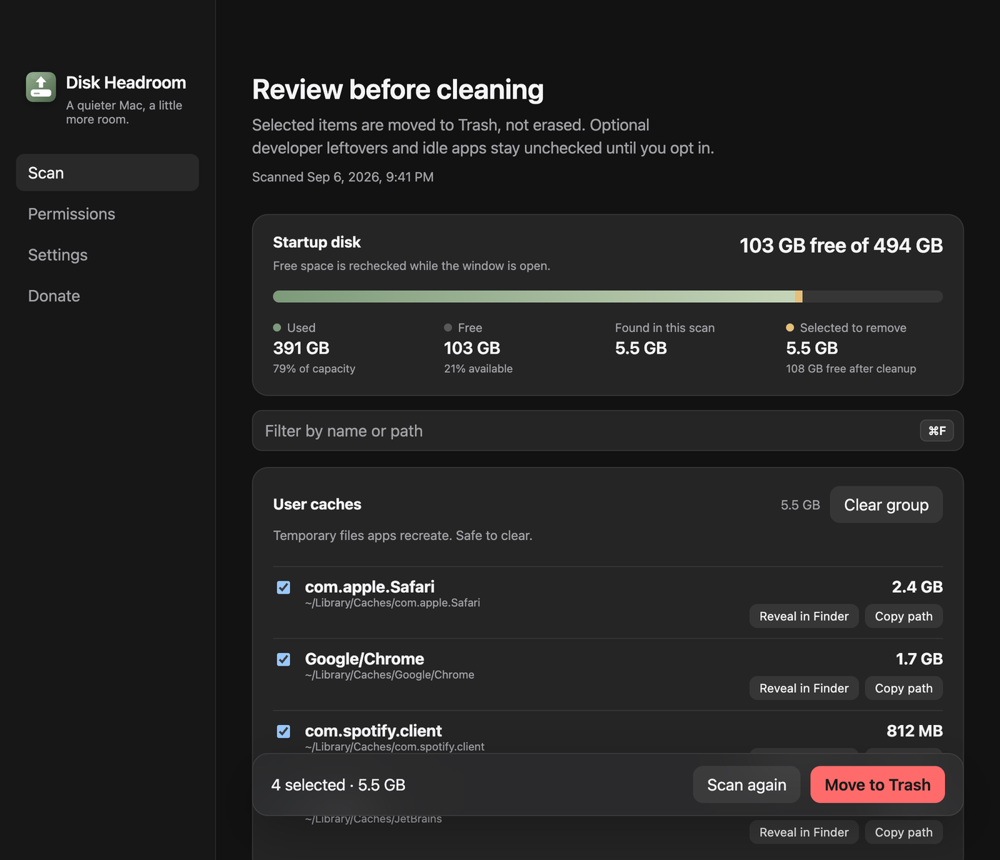
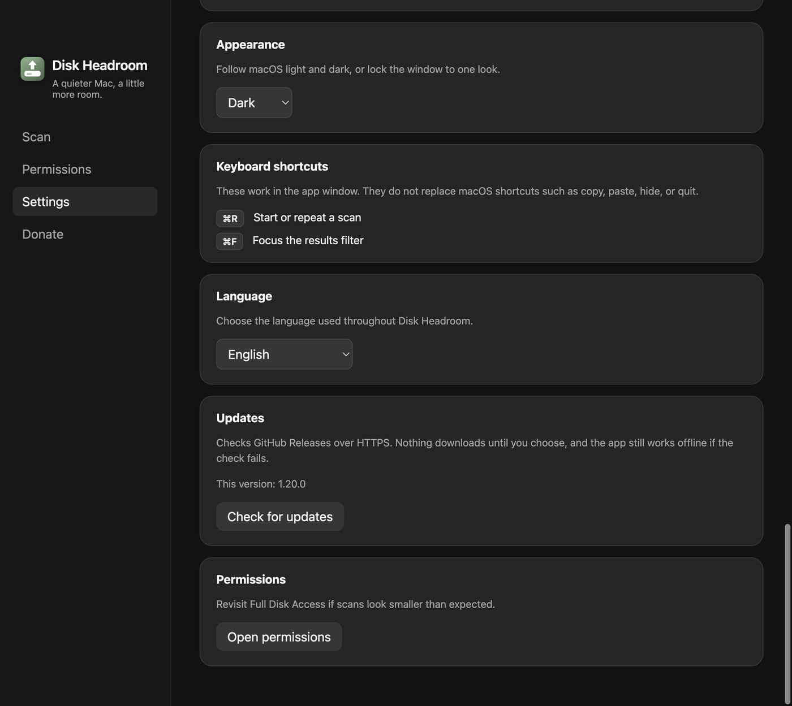

# Atalhos de teclado no scan e no filtro

- **Data:** 2026-09-06
- **Commit / PR:** #24
- **Tipo:** feat
- **Público:** quem já usa o scan e o filtro dos resultados várias vezes por semana
- **Formato sugerido no Instagram:** carrossel (1. scan com ⌘R, 2. resultados com ⌘F, 3. lista em Ajustes)

## O que mudou

- **⌘R** inicia ou repete uma verificação neste Mac.
- **⌘F** foca o filtro por nome ou caminho na lista de resultados.
- Os atalhos aparecem ao lado do botão Scan, no campo de filtro e num card em Ajustes.
- Inglês, português e espanhol. Não substituem copiar, colar, ocultar ou sair do macOS.

## Por que importa

Scan e filtro são as duas ações mais repetidas depois que a busca nos resultados existe — agora dá para fazê-las sem caçar o mouse.

## Legenda pronta (PT-BR)

O Disk Headroom ganhou atalhos de teclado.

⌘R inicia ou repete o scan. ⌘F foca o filtro dos resultados.

A lista fica em Ajustes. Nada muda na Lixeira: você continua revisando antes de mover arquivos.

Baixe o DMG nas Releases do GitHub.

#DiskHeadroom #macOS #SSD #Atalhos #Produtividade #OpenSource #MacApps #Electron #Armazenamento #UX

## Hashtags

`#DiskHeadroom` `#macOS` `#SSD` `#Atalhos` `#Produtividade` `#OpenSource` `#MacApps` `#Electron` `#Armazenamento` `#UX`

## Imagens

1. Scan com o atalho ao lado do botão

2. Resultados com o atalho no filtro

3. Ajustes com a lista de atalhos

