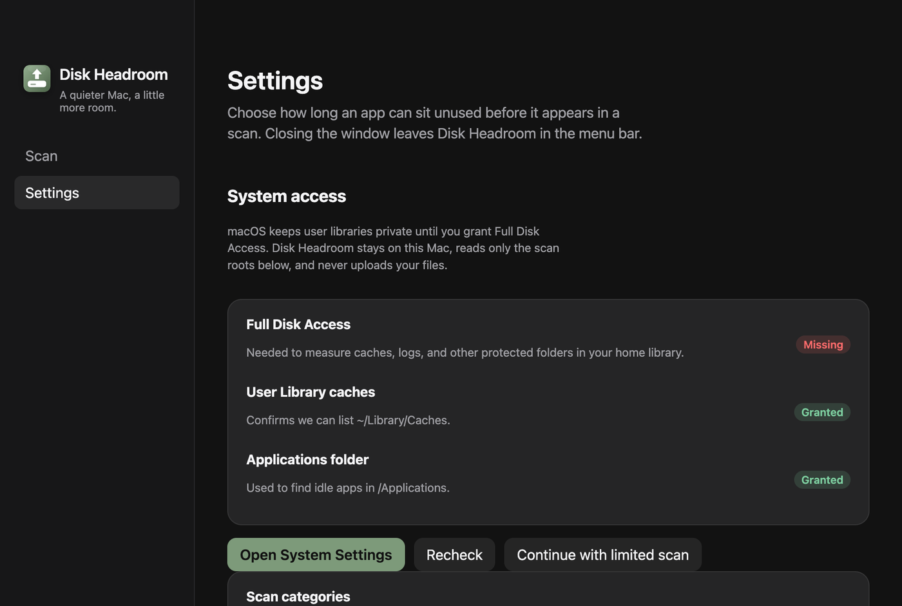
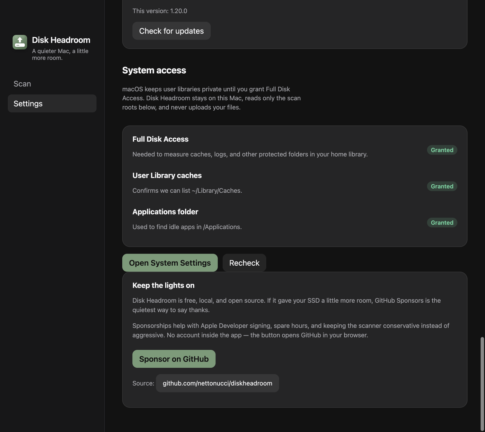

# Navegação só com Scan e Ajustes

- **Data:** 2026-09-06
- **Commit / PR:** —
- **Tipo:** melhoria de UI
- **Público:** quem abre o app no dia a dia e não precisa de quatro itens na barra
- **Formato sugerido no Instagram:** carrossel (1. barra com Scan e Ajustes, 2. permissões no primeiro uso, 3. doar no fim de Ajustes)

## O que mudou

- A barra lateral tem só **Scan** e **Ajustes**.
- Acesso ao disco (Full Disk Access, caches, Applications) fica em Ajustes. No primeiro uso, essa seção abre primeiro.
- GitHub Sponsors fica no card **Keep the lights on**, no fim de Ajustes. O menu da barra de menus ainda leva até lá.
- Scan, Lixeira e revisão dos resultados não mudam.

## Por que importa

Menos ruído na barra. Permissões e doar continuam no app, só que no lugar em que a gente já ajusta o resto.

## Legenda pronta (PT-BR)

O Disk Headroom ficou com duas seções: Scan e Ajustes.

Permissões e doar saíram da barra e foram para dentro de Ajustes. No primeiro uso você ainda concede o Acesso Total ao Disco antes de varrer o Mac.

Nada muda no scan nem na Lixeira: você continua revisando antes de mover arquivos.

Baixe o DMG nas Releases do GitHub.

#DiskHeadroom #macOS #SSD #UX #OpenSource #MacApps #Electron #Armazenamento #Acessibilidade #GitHubSponsors

## Hashtags

`#DiskHeadroom` `#macOS` `#SSD` `#UX` `#OpenSource` `#MacApps` `#Electron` `#Armazenamento` `#Acessibilidade` `#GitHubSponsors`

## Imagens

1. Barra só com Scan e Ajustes

2. Permissões no primeiro uso, dentro de Ajustes

3. Doar no fim de Ajustes

