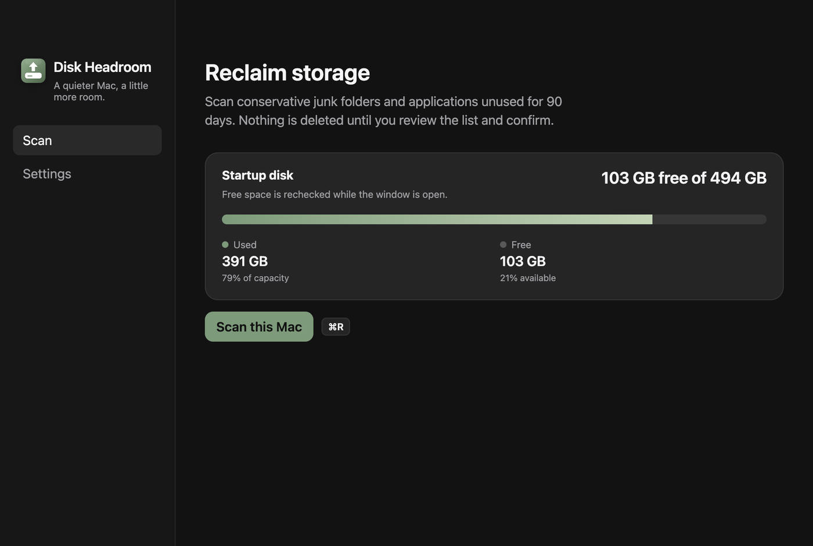

# Scan mais rápido, sem travar a janela

- **Data:** 2026-09-07
- **Commit / PR:** #74
- **Tipo:** melhoria de UI
- **Público:** quem o scan deixava o app lento ou congelado
- **Formato sugerido no Instagram:** único

## O que mudou

- O scan deixa de percorrer o disco uma chamada de arquivo por vez no processo principal.
- Pastas grandes (caches, npm, apps) são medidas em lote, então a barra anda e a janela responde.
- Mesmas categorias, mesmos limites e a mesma revisão antes de mandar para a Lixeira.

## Por que importa

Um scan que levava vários minutos e travava o app agora termina sem a janela congelar.

## Legenda pronta (PT-BR)

O scan do Disk Headroom ficou bem mais rápido.

Antes, pastas grandes (cache do Chrome, node_modules, apps em /Applications) faziam a janela travar. Agora o app continua respondendo enquanto mede o disco.

Você ainda revisa a lista e só o que marcar vai para a Lixeira.

Baixe o DMG nas Releases do GitHub.

#DiskHeadroom #macOS #SSD #Armazenamento #OpenSource #MacApps #Electron #Performance #DevTools #Limpeza

## Hashtags

`#DiskHeadroom` `#macOS` `#SSD` `#Armazenamento` `#OpenSource` `#MacApps` `#Electron` `#Performance` `#DevTools` `#Limpeza`

## Imagens

1. Painel de scan (a barra de progresso agora acompanha o trabalho de verdade)

