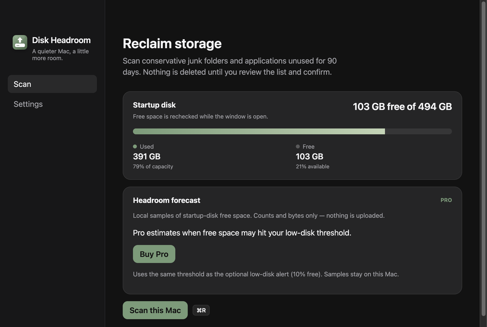
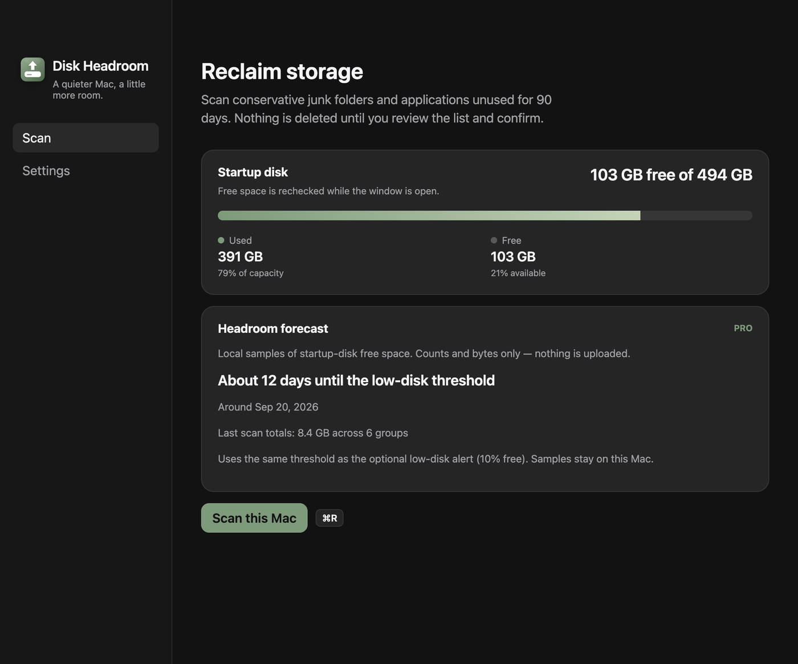
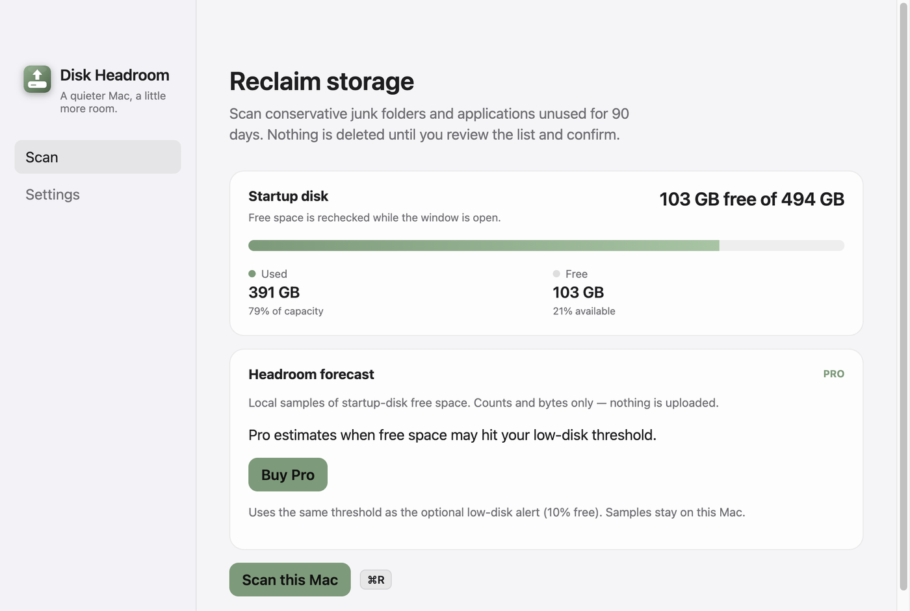

# Pro: previsão local de espaço livre

- **Data:** 2026-09-09
- **Commit / PR:** #44
- **Tipo:** feat
- **Público:** quem já usa o alerta de disco baixo e quer saber *quando* o espaço pode acabar; quem avalia o Pro
- **Formato sugerido no Instagram:** carrossel

## O que mudou

- No Scan, o card **Headroom forecast** estima os dias até o limiar de disco baixo (o mesmo do alerta opcional, padrão 10%).
- As amostras ficam só neste Mac: espaço livre e totais do último scan (contagens e bytes), sem caminhos de arquivo e sem rede.
- Sem Pro, o card explica a feature e leva a **Comprar Pro**. Com a chave, mostra dias, data aproximada e totais do último scan.
- A série é pequena (no máximo 90 amostras / 90 dias). A Lixeira continua igual: nada vai para a Trash sozinho.

## Por que importa

O alerta free avisa quando o disco já está apertado. O Pro tenta mostrar o prazo, ainda offline.

## Legenda pronta (PT-BR)

O Disk Headroom Pro agora estima quantos dias faltam para o disco apertar.

Amostras locais de espaço livre — e os totais do último scan, só números. Nada sobe para a nuvem, sem conta. Sem a chave, o card no Scan aponta para o Pro. Com ela, você vê o prazo até o mesmo limiar do alerta de disco baixo.

Revisão continua manual. O que você escolher vai para a Lixeira, não some sozinho.

Baixe o DMG nas GitHub Releases. Estrela ajuda. Sponsor também.

## Hashtags

#DiskHeadroom #macOS #SSD #Electron #indiehackers #opensource #MacApps #Pro #privacidade #armazenamento

## Imagens

1. `imagens/scan.png` — Scan sem Pro: card de previsão com CTA.
2. `imagens/scan-forecast.png` — Scan com Pro: dias até o limiar e totais do último scan.
3. `imagens/scan-light.png` — Mesma tela no tema claro (CTA).

