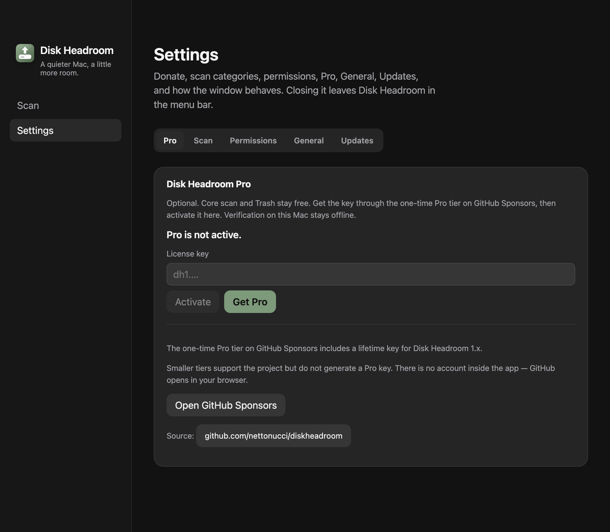

# Pro e apoio em um só lugar

- **Data:** 2026-09-10
- **Commit / PR:** a definir
- **Tipo:** melhoria de UI
- **Público:** quem quer apoiar o Disk Headroom ou ativar os recursos Pro
- **Formato sugerido no Instagram:** carrossel

## O que mudou

- Ajustes agora tem uma única aba Pro para licença e apoio.
- A chave continua sendo verificada offline no Mac.
- O botão Obter Pro abre o fluxo do tier Pro no GitHub Sponsors.
- O painel explica que o tier Pro gera a chave 1.x e valores menores são somente apoio.
- O link do projeto continua acessível no mesmo painel.
- A aba Doar separada foi removida; o atalho da bandeja abre diretamente a aba Pro.

## Por que importa

Comprar, ativar e apoiar agora ficam no mesmo lugar, com a diferença entre licença Pro e contribuição simples explicada antes do clique.

## Legenda pronta (PT-BR)

Pro e apoio agora moram na mesma aba do Disk Headroom.

O tier Pro de pagamento único no GitHub Sponsors inclui a chave vitalícia da major 1.x. Você reivindica a chave no site, cola nos Ajustes e a verificação acontece offline no Mac.

Quer contribuir com um valor menor? Também ajuda — só não gera licença Pro.

O app continua gratuito, local e conservador: você revisa tudo antes de enviar os itens escolhidos para a Lixeira.

Baixe o DMG nas GitHub Releases, deixe uma estrela ou apoie pelo Sponsors.

## Hashtags

#DiskHeadroom #macOS #Mac #Armazenamento #OpenSource #GitHubSponsors #IndieDev #AppleSilicon #Privacidade #UtilitarioMac

## Imagens

1. `imagens/pro.png` — aba Pro unificada com status, ativação, GitHub Sponsors e código-fonte.

