# Site renovado com a linguagem visual do Positivus

- **Data:** 2026-09-10
- **Commit / PR:** a definir
- **Tipo:** melhoria de UI
- **Público:** pessoas que querem conhecer, baixar ou apoiar o Disk Headroom
- **Formato sugerido no Instagram:** carrossel

## O que mudou

- A identidade visual inspirada no Positivus agora está em todas as páginas do site.
- Home, Download, Pro, FAQ, Privacidade, Contato, Termos e Reembolsos compartilham o mesmo sistema de cards, bordas, sombras e títulos.
- O menu ganhou uma barra destacada, com marcação clara da página atual, animações no toque e no mouse, e um painel em card no celular.
- Idioma e tema agora formam um controle único: nome completo no desktop, código curto no celular e transição animada entre lua e sol.
- As telas reais do app foram recapturadas na interface atual, em pares claros e escuros que acompanham automaticamente o tema do site.
- Tema claro, tema escuro e layout responsivo foram preservados.
- O fluxo de compra e ativação Pro continua igual; somente a apresentação mudou.

## Por que importa

Agora ficou mais fácil entender como o Disk Headroom funciona, conferir seus limites e encontrar o download sem perder a personalidade local-first do projeto.

## Legenda pronta (PT-BR)

O site do Disk Headroom está de cara nova. 💾

A nova linguagem visual organiza melhor o download, o funcionamento do app, o Pro e as informações de privacidade — mantendo o que importa: você revisa cada grupo antes de enviar qualquer item para a Lixeira.

Sem promessa de limpeza milagrosa, sem nuvem e sem telemetria.

Baixe o DMG nas Releases do GitHub, experimente no seu Mac e deixe uma estrela no projeto.

## Hashtags

#DiskHeadroom #macOS #MacApp #OpenSource #LocalFirst #Privacidade #Armazenamento #SSD #GitHub #IndieDev

## Imagens

1. `imagens/home-redesign.png` — Nova abertura da home com tipografia ampla, CTA e identidade verde.
2. `imagens/download-redesign.png` — Página de download com requisitos e orientação de instalação.
3. `imagens/pro-redesign.png` — Página Pro com compra única e ativação offline.
4. `imagens/menu-mobile.png` — Menu do celular aberto em card, com a página atual destacada.
5. `imagens/app-scan-light.png` — Tela inicial atual do app no tema claro.
6. `imagens/app-scan-dark.png` — Tela inicial atual do app no tema escuro.
7. `imagens/app-results-light.png` — Revisão antes da limpeza no tema claro.
8. `imagens/app-results-dark.png` — Revisão antes da limpeza no tema escuro.
9. `imagens/app-developer-light.png` — Grupos de desenvolvimento opcionais no tema claro.
10. `imagens/app-developer-dark.png` — Grupos de desenvolvimento opcionais no tema escuro.
11. `imagens/app-pro-light.png` — Ativação Pro offline no tema claro.
12. `imagens/app-pro-dark.png` — Ativação Pro offline no tema escuro.
13. `imagens/app-permissions-light.png` — Permissões do macOS no tema claro.
14. `imagens/app-permissions-dark.png` — Permissões do macOS no tema escuro.
15. `imagens/app-settings-light.png` — Categorias de varredura no tema claro.
16. `imagens/app-settings-dark.png` — Categorias de varredura no tema escuro.

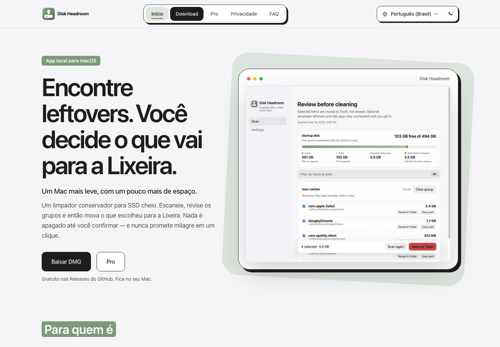

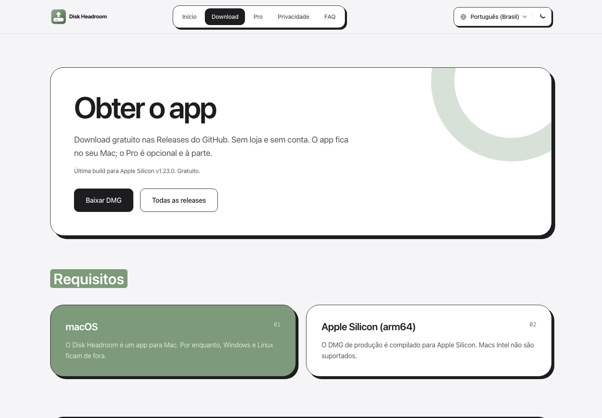

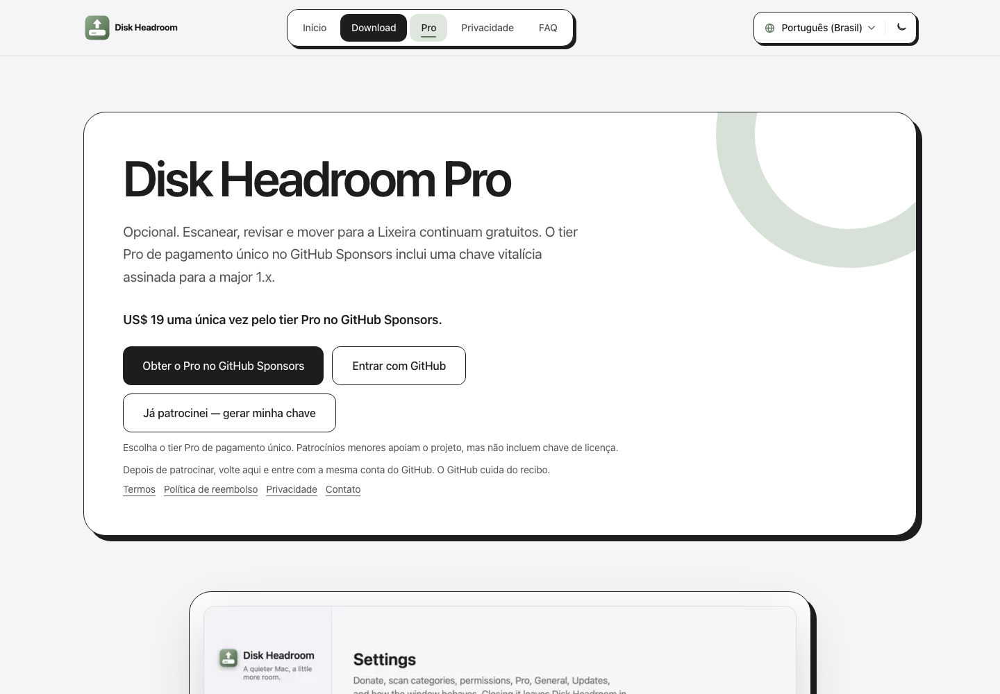

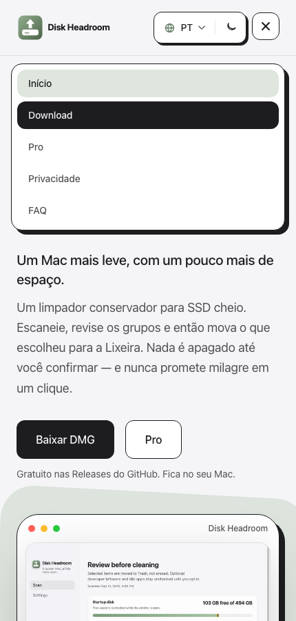

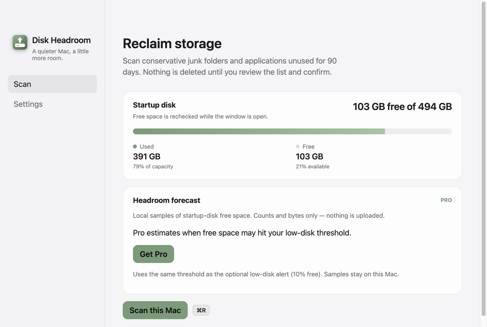

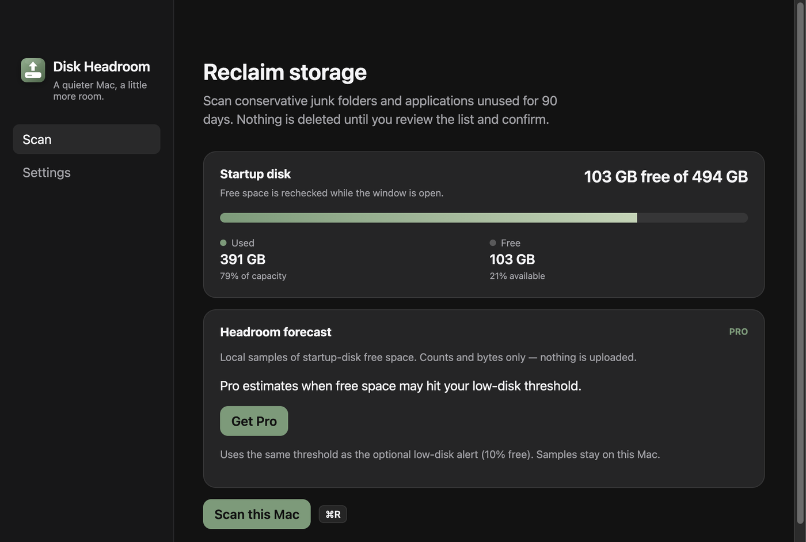

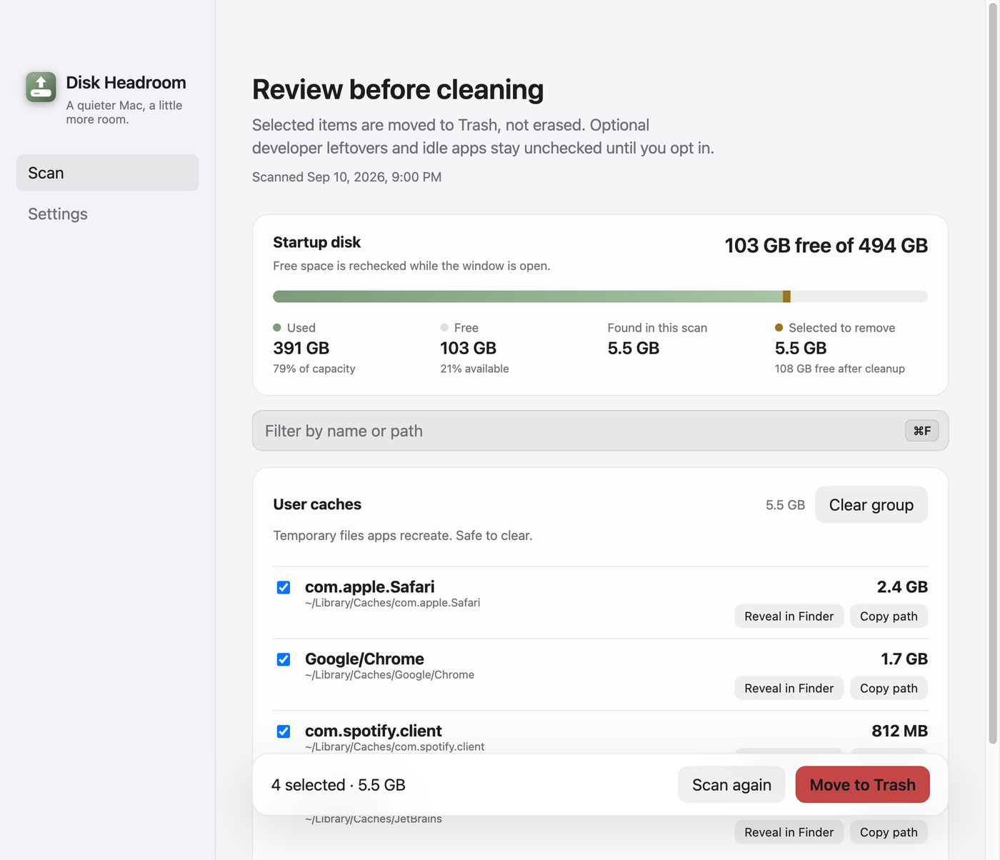

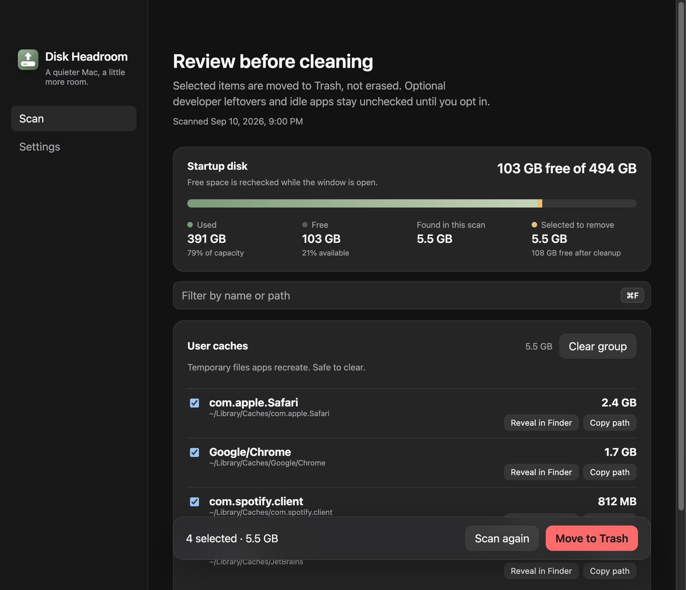

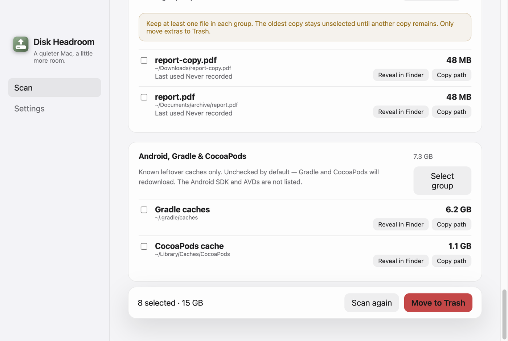

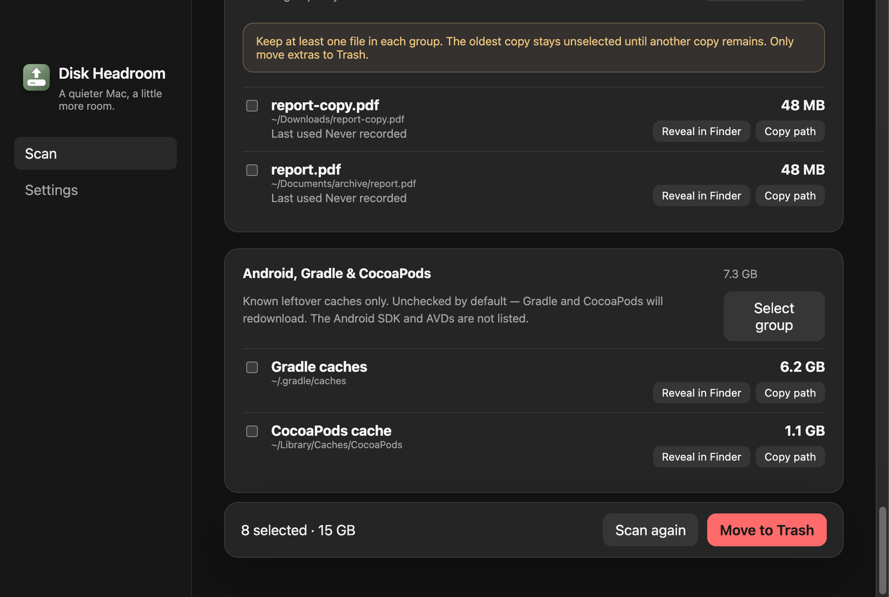

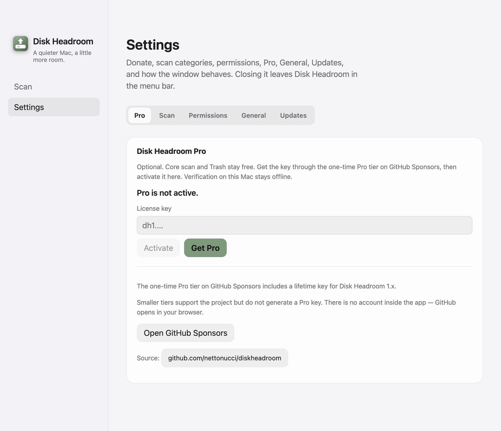

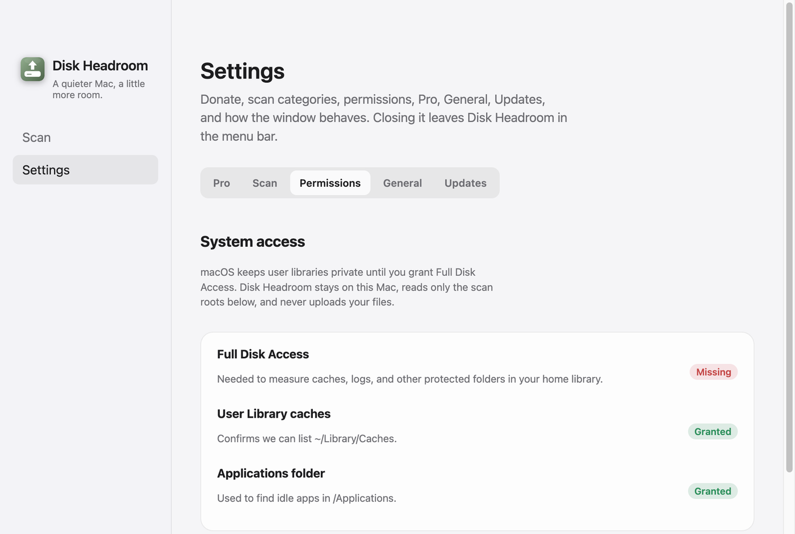

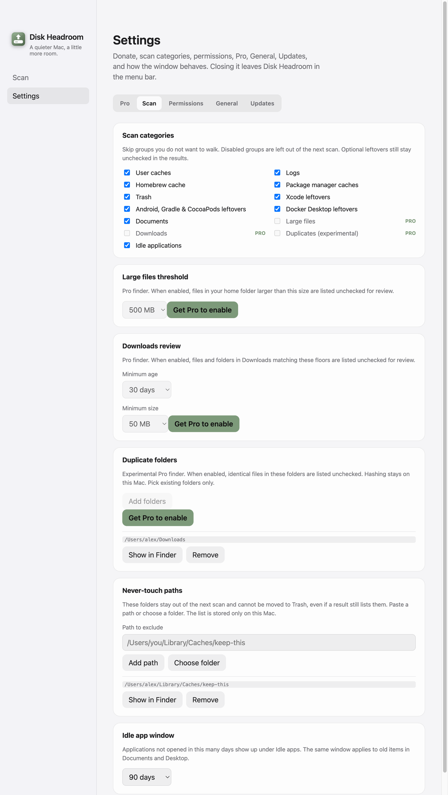

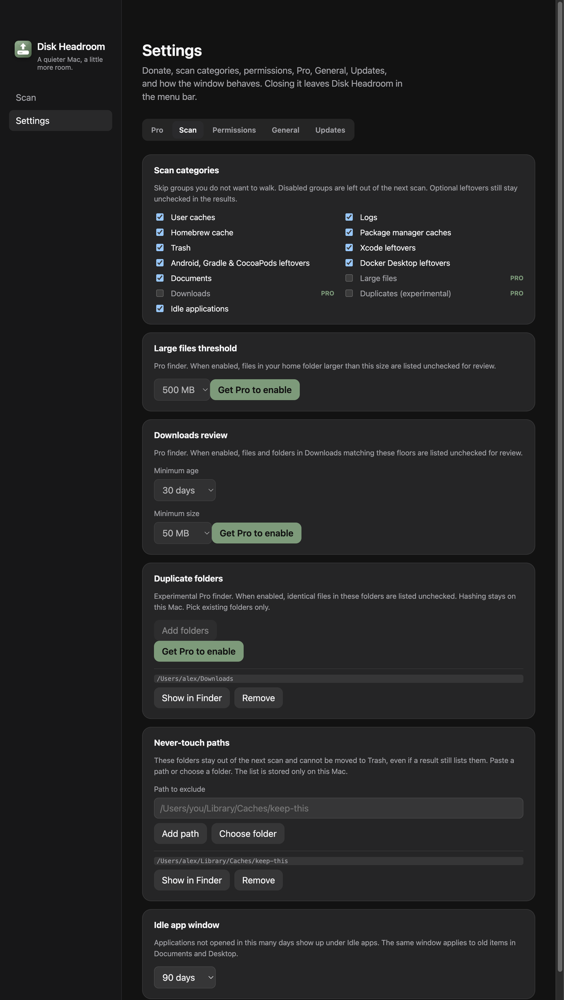
