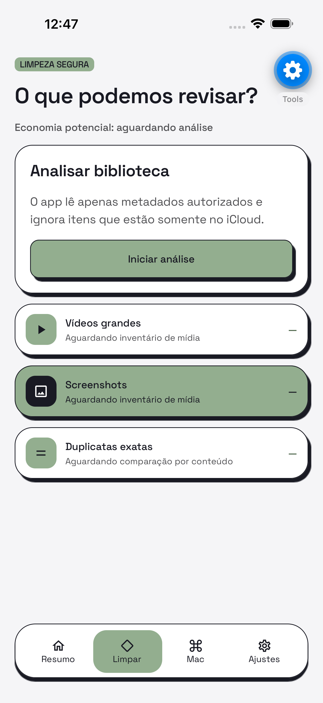
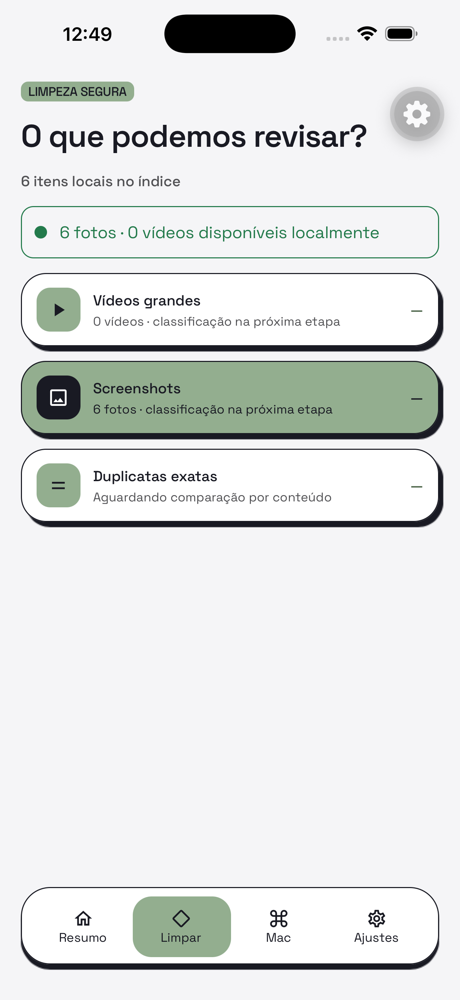

# Inventário local de fotos e vídeos

- **Data:** 2026-09-11
- **Commit / PR:** diskheadroom-app-mobile `0b41023`
- **Tipo:** feat
- **Público:** pessoas que testam o Disk Headroom no iPhone
- **Formato sugerido no Instagram:** carrossel

## O que mudou

- O app para iPhone agora cria um inventário local das fotos e dos vídeos autorizados.
- A análise mostra progresso, pode ser cancelada e preserva o último índice completo.
- Itens disponíveis somente no iCloud são ignorados sem download silencioso.
- O Resumo, a tela Limpar e os Ajustes exibem o estado real do índice.
- O inventário armazena somente metadados mínimos no aparelho e pode ser apagado nos Ajustes.
- O acesso limitado do iOS continua respeitando apenas os itens escolhidos pela pessoa.

## Por que importa

O Disk Headroom já consegue entender quais mídias estão disponíveis localmente sem enviar conteúdo nem inventar estimativas de espaço.

## Legenda pronta (PT-BR)

O inventário local chegou ao Disk Headroom para iPhone. 📱

Agora o app organiza, no próprio aparelho, os metadados mínimos das fotos e dos vídeos que você autorizou. A análise pode ser cancelada, respeita o acesso limitado do iOS e não baixa itens que estão somente no iCloud.

Este é o primeiro passo para sugerir revisões úteis de vídeos grandes, screenshots e duplicatas — sempre com confirmação antes de qualquer ação.

Acompanhe o desenvolvimento, deixe uma estrela no GitHub e conte quais revisões você quer ver primeiro.

#DiskHeadroom #iPhone #iOS #Privacidade #OpenSource #Armazenamento #Fotos #Videos #ReactNative #Expo

## Hashtags

#DiskHeadroom #iPhone #iOS #Privacidade #OpenSource #Armazenamento #Fotos #Videos #ReactNative #Expo

## Imagens

1. `imagens/limpar-antes-da-analise.png` — tela Limpar antes do primeiro inventário.
2. `imagens/inventario-concluido.png` — tela Limpar com fotos e vídeos locais indexados.

