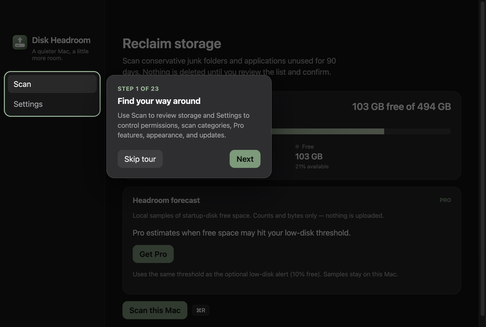
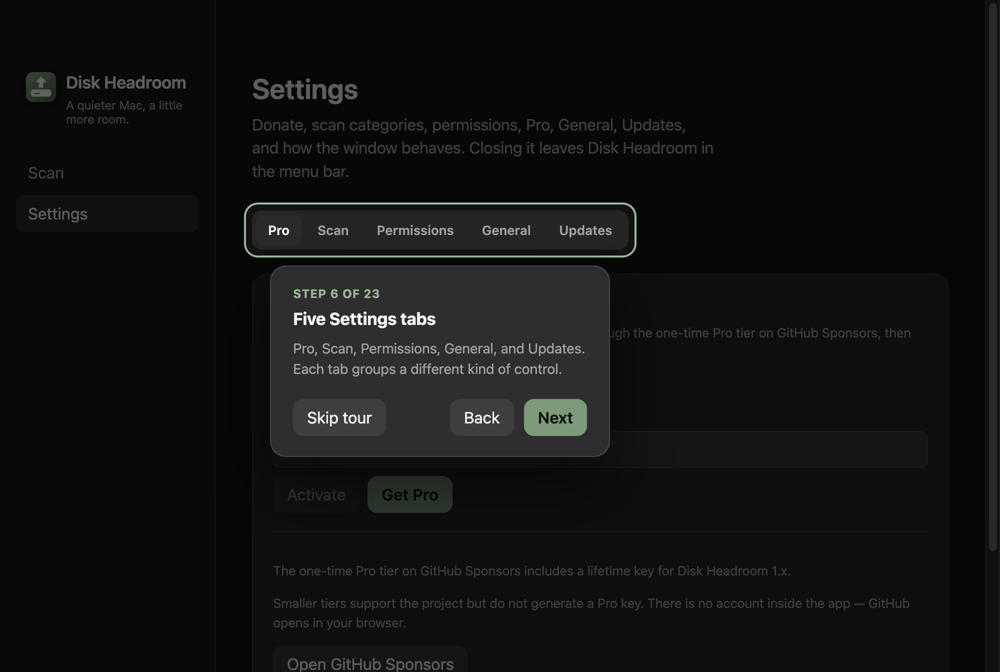

# Product tour na primeira abertura

- **Data:** 2026-09-11
- **Commit / PR:** —
- **Tipo:** feat
- **Público:** quem está conhecendo o Disk Headroom e quem quer rever o fluxo principal
- **Formato sugerido no Instagram:** único

## O que mudou

- Depois de escolher tema e idioma, um tour apresenta as áreas principais do app.
- Cinco etapas no dashboard destacam a navegação, o espaço disponível, a previsão de headroom, o botão de verificação e os Ajustes.
- Em seguida o tour abre Ajustes e explica cada aba: Pro, Categorias, Permissões, Geral e Atualizações — item a item.
- É possível avançar, voltar, pular ou fechar o tour com Escape.
- O tour pode ser aberto novamente em Ajustes → Geral.
- Ao terminar, o primeiro uso continua na configuração de permissões.

## Por que importa

O fluxo principal e as garantias de segurança ficam claros antes da primeira verificação.

## Legenda pronta (PT-BR)

O Disk Headroom agora apresenta o app antes da primeira verificação.

Depois de escolher tema e idioma, um tour mostra o dashboard e depois cada aba de Ajustes: o que o Pro ativa, o que cada finder verifica, permissões, alertas e atualizações.

Você pode avançar, voltar ou pular — e rever tudo depois em Ajustes → Geral.

O tour também reforça o mais importante: nada vai para a Lixeira antes de você revisar os resultados e confirmar.

Baixe o DMG nas Releases do GitHub.

#DiskHeadroom #macOS #SSD #Armazenamento #ProductTour #Onboarding #MacApps #OpenSource #Electron #UX #Acessibilidade

## Hashtags

`#DiskHeadroom` `#macOS` `#SSD` `#Armazenamento` `#ProductTour` `#Onboarding` `#MacApps` `#OpenSource` `#Electron` `#UX` `#Acessibilidade`

## Imagens

1. Primeira etapa do product tour destacando a navegação principal

2. Tour em Ajustes, explicando as abas

