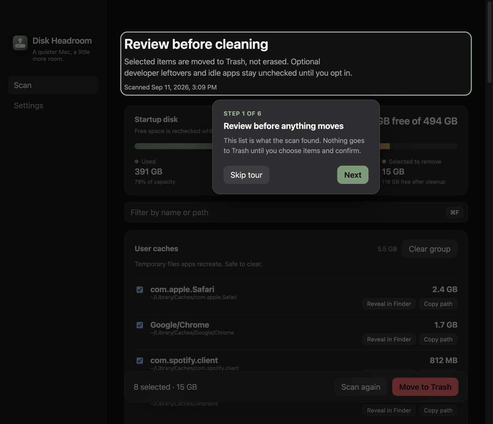

# Tour dos resultados no primeiro scan

- **Data:** 2026-09-11
- **Commit / PR:** —
- **Tipo:** feat
- **Público:** quem faz o primeiro scan e ainda não conhece a tela de resultados
- **Formato sugerido no Instagram:** único

## O que mudou

- Depois do primeiro scan com itens encontrados, um tour apresenta a tela de resultados.
- Seis etapas destacam o resumo, o espaço encontrado/selecionado, o filtro, os grupos, cada item e a barra de ações.
- É possível avançar, voltar, pular ou fechar com Escape.
- Se o primeiro scan não achar nada, o tour não aparece e não volta a pedir.
- O tour do app na primeira abertura continua igual; este é só para a lista achada.

## Por que importa

Quem chega nos resultados pela primeira vez entende o que pode marcar, filtrar e mover — e que nada vai para a Lixeira sem confirmação.

## Legenda pronta (PT-BR)

Depois do primeiro scan, o Disk Headroom agora explica a tela de resultados.

Um tour curto mostra o que a verificação encontrou, como filtrar, marcar por categoria, inspecionar um item e só então confirmar o envio para a Lixeira.

Nada some sozinho. Você revisa, escolhe e confirma.

Baixe o DMG nas Releases do GitHub.

#DiskHeadroom #macOS #SSD #Armazenamento #ProductTour #Onboarding #MacApps #OpenSource #Electron #UX #Lixeira

## Hashtags

`#DiskHeadroom` `#macOS` `#SSD` `#Armazenamento` `#ProductTour` `#Onboarding` `#MacApps` `#OpenSource` `#Electron` `#UX` `#Lixeira`

## Imagens

1. Primeira etapa do tour dos resultados, destacando o cabeçalho da lista

