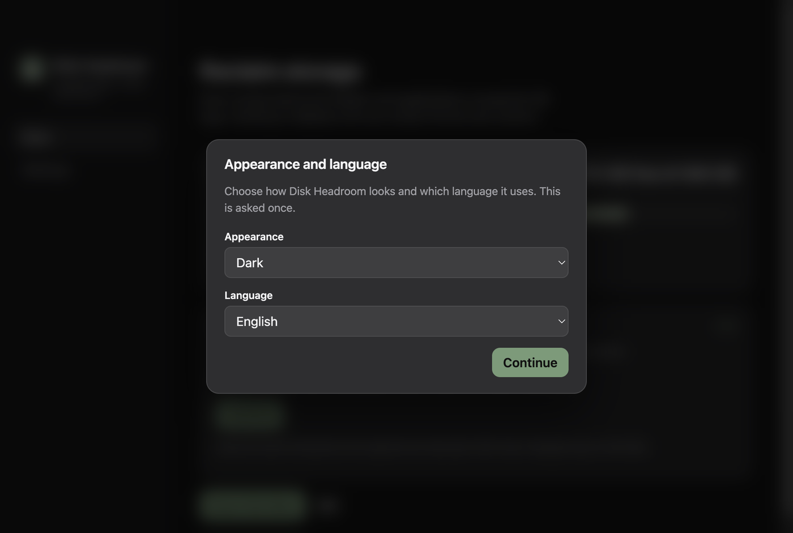
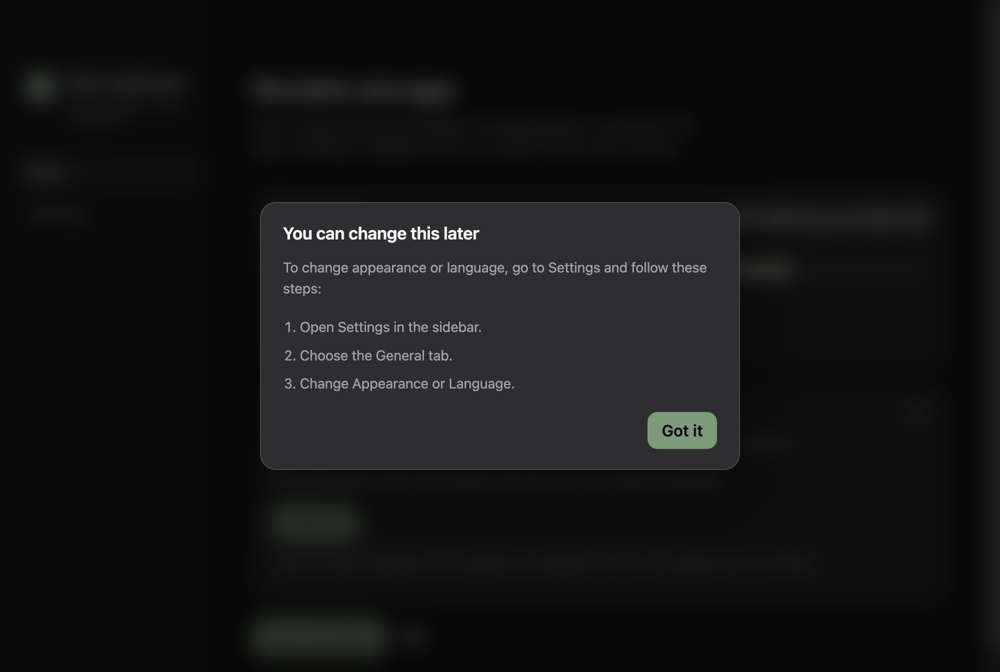
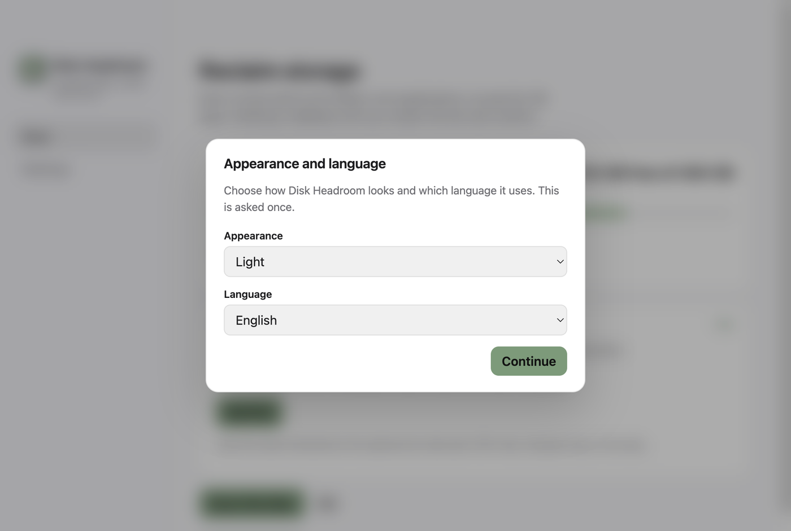

# Primeira abertura: tema e idioma

- **Data:** 2026-09-11
- **Commit / PR:** —
- **Tipo:** feat
- **Público:** quem instala agora e quem já tinha o app sem essa escolha salva
- **Formato sugerido no Instagram:** carrossel (1. modal escuro, 2. passo a passo, 3. modal claro)

## O que mudou

- Na primeira abertura, um modal pede aparência (sistema, escuro ou claro) e idioma (inglês, português ou espanhol).
- Depois da escolha, o app explica como mudar isso em Ajustes → Geral.
- A escolha fica salva: o modal não volta.
- Quem já usa o app e ainda não tem essa configuração também vê o modal uma vez.

## Por que importa

Tema e idioma deixam de ser um achado em Ajustes: você escolhe na hora, e sabe onde mexer depois.

## Legenda pronta (PT-BR)

Na primeira vez que o Disk Headroom abre, você escolhe o tema e o idioma.

Escuro, claro ou seguir o Mac. Inglês, português ou espanhol. A escolha fica salva.

Se quiser mudar depois: Ajustes, aba Geral, Aparência ou Idioma.

Quem já tinha o app e ainda não fez essa escolha também vê o modal uma vez. Nada vai para a Lixeira sozinho.

Baixe o DMG nas Releases do GitHub.

#DiskHeadroom #macOS #SSD #OpenSource #MacApps #Electron #Acessibilidade #DarkMode #Idioma #Armazenamento

## Hashtags

`#DiskHeadroom` `#macOS` `#SSD` `#OpenSource` `#MacApps` `#Electron` `#Acessibilidade` `#DarkMode` `#Idioma` `#Armazenamento`

## Imagens

1. Modal de aparência e idioma no tema escuro

2. Passo a passo para mudar depois em Ajustes

3. O mesmo modal no tema claro

