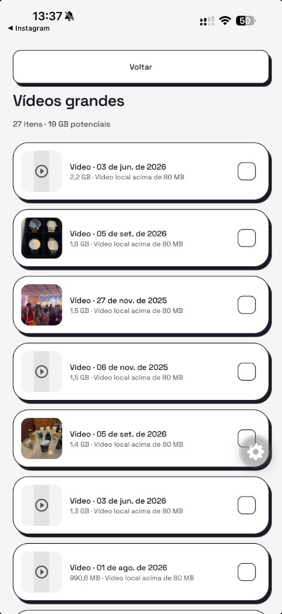

# Vídeos grandes e screenshots no iPhone

- **Data:** 2026-09-12
- **Commit / PR:** diskheadroom-app-mobile #48
- **Tipo:** feat
- **Público:** pessoas que testam o Disk Headroom no iPhone
- **Formato sugerido no Instagram:** carrossel

## O que mudou

- O inventário local agora separa vídeos grandes e capturas de tela em listas revisáveis.
- O limiar padrão é 80 MB e vale para o tamanho real medido no aparelho, não para uma estimativa.
- As capturas só entram quando o próprio iOS marca o item como screenshot ou quando ele está no álbum de capturas; nada é deduzido pelo nome do arquivo.
- Cada linha mostra miniatura, data, tamanho e o motivo da sugestão.
- Dá para marcar itens e ver quanto espaço a seleção representa. Nada vem marcado e nada é apagado.
- Os totais ficam guardados no aparelho e continuam disponíveis offline, sem nova análise.

## Por que importa

O app passa a dizer o que ocupa espaço de verdade e por quê, sem escolher nada por você.

## Legenda pronta (PT-BR)

O Disk Headroom para iPhone agora mostra onde o espaço foi parar. 📱

Vídeos grandes e capturas de tela aparecem em listas separadas, com miniatura, data, tamanho real e o motivo de cada sugestão. O limiar padrão é 80 MB, medido no arquivo que está no aparelho.

Captura de tela só entra quando o iOS marca o item como captura ou quando ele está no álbum de capturas. Nada é adivinhado pelo nome do arquivo, e nenhum item que mora só no iCloud é baixado.

Nada vem pré-selecionado e nada é apagado: você marca o que quer revisar e vê quanto aquilo representa. A exclusão, com confirmação do sistema, vem a seguir.

Deixe uma estrela no GitHub e conte o que você quer revisar primeiro.

#DiskHeadroom #iPhone #iOS #Privacidade #OpenSource #Armazenamento #Fotos #Videos #ReactNative #Expo

## Hashtags

#DiskHeadroom #iPhone #iOS #Privacidade #OpenSource #Armazenamento #Fotos #Videos #ReactNative #Expo

## Imagens

> **Antes de postar:** esta captura é de uma biblioteca real e as miniaturas mostram vídeos pessoais. Troque por uma biblioteca de teste ou borre as miniaturas. A bolha flutuante no canto direito é o menu de desenvolvimento e não aparece em build de produção.

1. `imagens/videos-grandes.png` — lista de vídeos grandes com tamanho medido e motivo por item.

