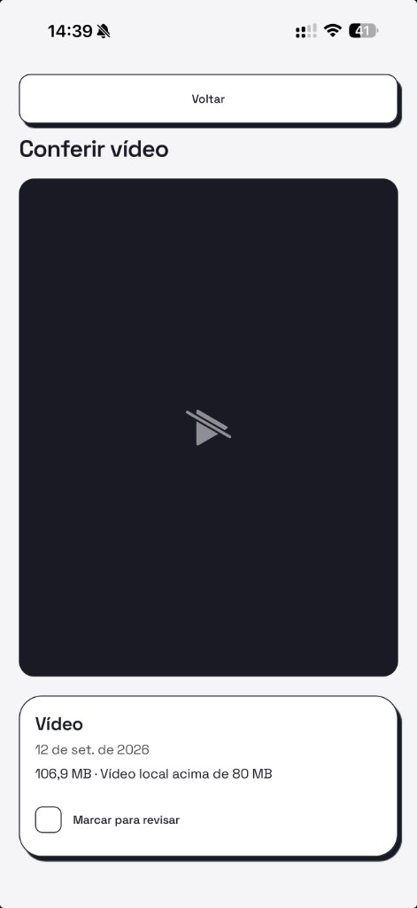

# Conferir a mídia sugerida no iPhone

- **Data:** 2026-09-12
- **Commit / PR:** diskheadroom-app-mobile #49
- **Tipo:** feat
- **Público:** pessoas que testam o Disk Headroom no iPhone
- **Formato sugerido no Instagram:** carrossel

## O que mudou

- Tocar num vídeo grande ou numa captura abre a mídia em tela cheia, dentro do próprio app.
- Vídeos locais tocam com o reprodutor nativo. Capturas aparecem ampliadas, no tamanho da tela.
- Data, tamanho medido e motivo da sugestão ficam visíveis junto do item.
- Dá para marcar e desmarcar a mídia nessa tela; a seleção volta para a lista.
- Nada é baixado do iCloud. Se o item saiu do aparelho, o app avisa e não puxa a nuvem.
- Sair da tela pausa a reprodução. Nada é apagado.

## Por que importa

Dá para olhar o arquivo de verdade antes de decidir o que revisar, sem abrir o app Fotos e sem baixar nada da nuvem.

## Legenda pronta (PT-BR)

Agora dá para conferir o vídeo ou a captura antes de marcar. 📱

No Disk Headroom para iPhone, um toque na lista abre a mídia em tela cheia, com data, tamanho real e o motivo da sugestão. Você marca ou desmarca ali mesmo, e a seleção volta para a lista.

O app só reproduz o que já está no aparelho. Item que mora só no iCloud não é baixado. E nada é apagado: a exclusão, com confirmação do sistema, vem a seguir.

Deixe uma estrela no GitHub e conte o que você quer revisar primeiro.

#DiskHeadroom #iPhone #iOS #Privacidade #OpenSource #Armazenamento #Fotos #Videos #ReactNative #Expo

## Hashtags

#DiskHeadroom #iPhone #iOS #Privacidade #OpenSource #Armazenamento #Fotos #Videos #ReactNative #Expo

## Imagens

> **Antes de postar:** esta captura é de uma biblioteca real. Troque por uma biblioteca de teste ou borre qualquer conteúdo pessoal. A bolha flutuante no canto direito é o menu de desenvolvimento e não aparece em build de produção.

1. `imagens/conferir-video.png` — visualizador em tela cheia com data, tamanho medido, motivo e marcação.

